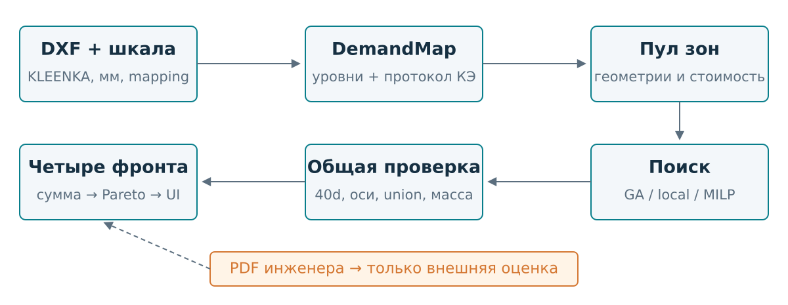
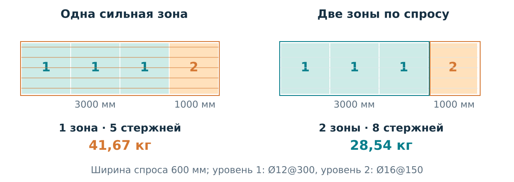
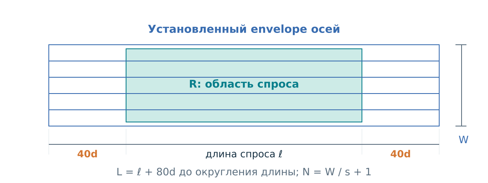
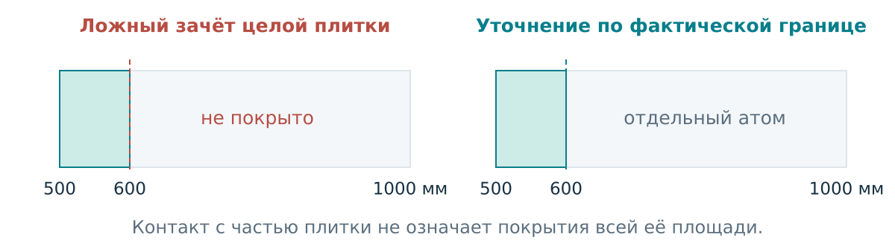
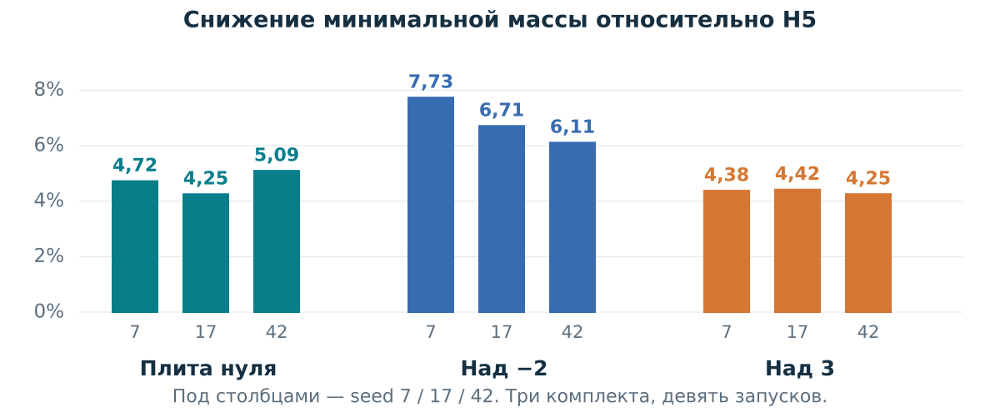
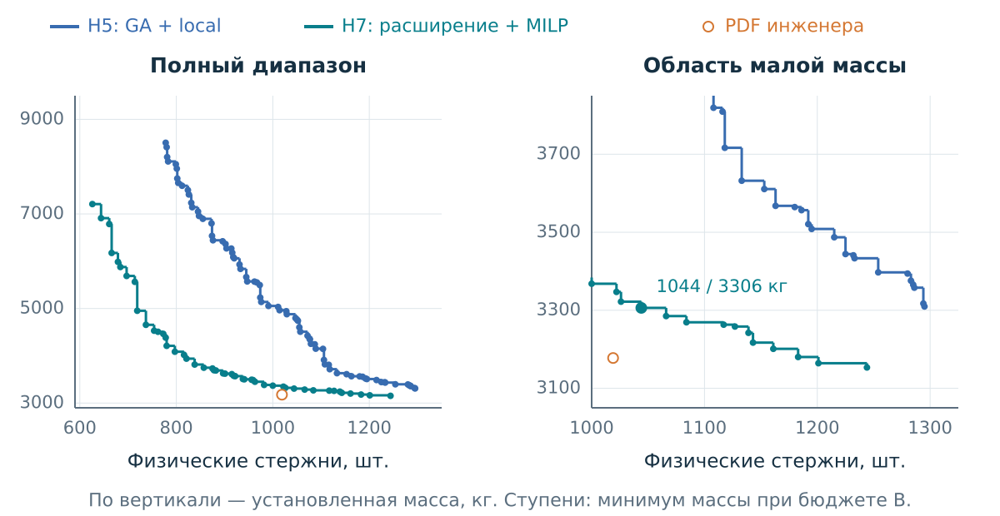
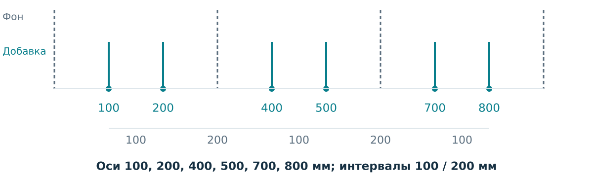

# Qmonitoring × A101: математика, устройство и результаты

Документ для подготовки к защите хакатона. Срез локального проекта на **9 сентября 2026 года**; базовый commit `1940faf` и присутствующие в рабочем дереве изменения интеграции Revit. Это объяснение реализованной модели и сохранённых экспериментов, а не расчётная записка для выпуска строительной документации.

**Как читать.** Разделы 1–3 дают общую картину; 4–9 объясняют математику и алгоритмы; 10–12 разбирают доказательства и интеграцию; 13–15 помогают решить, что делать дальше и что говорить на защите. В конце — карта кода, источники и команды воспроизведения.

**Overleaf.** В корне лежит самостоятельный `PITCH_EXPLAINED.tex`: скопировать его содержимое целиком в `main.tex` либо загрузить и назначить главным файлом; компилятор — **pdfLaTeX**. Рисунки и данные графиков встроены в LaTeX через TikZ/PGFPlots; внешние изображения, приватные DXF/PDF и библиография `.bib` для сборки не нужны. Markdown-версия содержит тот же основной текст, а её SVG-иллюстрации находятся в `docs/pitch_figures/`.

## 1. Что мы на самом деле делаем

ЛИРА-САПР уже рассчитала железобетонную плиту и выдала мозаику: для каждого конечного элемента известно, какое армирование требуется. Инженер должен превратить эту подробную карту в конструктивные группы стержней. Наш проект автоматизирует именно переход от карты требований к вариантам раскладки **дополнительной** арматуры.

Фоновые стержни считаются заданными. Мы не пересчитываем нагрузки, напряжения, прогибы или несущую способность плиты средствами МКЭ. Поэтому качество нашего покрытия и корректность исходного расчёта ЛИРА — разные вопросы.

Одна плита приходит четырьмя направлениями: нижнее X, нижнее Y, верхнее X, верхнее Y. В нынешнем оптимизаторе они решаются геометрически независимо. Затем их варианты комбинируются в общеплитный фронт по суммарной массе и выбранной мере сложности. Физическое согласование высот X/Y в Revit остаётся отдельной задачей.

Выход ядра — параметрическая прямоугольная зона: положение, направление, диаметр, шаг, первая ось, количество и установленная длина стержней. Полный список объектов Revit для поиска не нужен: линии восстанавливаются из параметров.

**Конфликт целей.** Крупная зона проще для чтения и размещения, но может протянуть сильную арматуру через слабые участки. Мелкие зоны точнее следуют спросу, но размножают группы, стержни и повторные выпуски анкеровки. Поэтому полезен набор компромиссов, среди которых выбирает конструктор.

> Фраза для питча: «Мы превращаем расчётные изополя в несколько проверяемых вариантов дополнительного армирования и показываем цену компромисса между расходом стали и сложностью раскладки».

## 2. Состояние проекта: три разных уровня готовности

| Уровень | Что уже есть | Что это подтверждает |
|---|---|---|
| Основной core/web | DXF-ingest, mapping, четыре направления, GA, независимый 2D-валидатор, Парето, SVG и JSON | Работающий сценарий построения исследовательских раскладок для поддерживаемых входов |
| Усиленный исследовательский профиль H7 | GA + локальный поиск + новые геометрии + MILP | Дополнительный выигрыш на трёх комплектах за дополнительный вычислительный бюджет |
| Интеграционный трек Revit | Реальные чтение, создание, Commit, повторное чтение и откат; перенос одной синтетической зоны ядра | Работоспособность узких API-сценариев; полного применения оптимизированной плиты ещё нет |

H7 включается явно. Наличие SciPy не включает его автоматически. Web по умолчанию использует GA с 16 особями, 30 поколениями, seed 42 и UCB1; общая реализация уже включает `demand_fragments` и четыре прохода локального поиска. MILP и геометрическое расширение H7 по умолчанию выключены. Главные эксперименты H7 ниже используют **8 особей, 3 поколения, uniform и три seed**, поэтому их нельзя выдавать за замер web-default. [S2, S5]

Есть и вторая граница моделей: обычный `LayoutZone` использует один дополнительный набор с равномерным шагом. Новый `CompositeLayoutZone` хранит несколько наборов и периодические оси. Парсер уже сохраняет составные схемы, но старый `LayoutProblem` явно отклоняет уровни с несколькими добавками. Полноценного составного GA пока нет. [S7]

## 3. Пайплайн: от файла до выбранного варианта



1. `read_mosaic` читает из DXF только `3DFACE` слоя `KLEENKA`. Служебные копии `PLAST` отбрасываются; повторная четвёртая вершина треугольника удаляется.
2. Единицы приводятся к миллиметрам: по заголовку DXF, а при отсутствии надёжных единиц — по геометрической эвристике. Способ и масштаб сохраняются в метаданных.
3. Порядок полос и границы шкалы связываются с совместимым `.shk` либо явно выбранным mapping. Цвет ACI сам по себе не определяет универсальное значение армирования.
4. Адаптер создаёт `DemandMap` и `LayoutProblem`; отдельная предобработка протоколирует разрешённые понижения одиночных КЭ.
5. Алгоритм выбирает прямоугольники. Общий конструктор считает их физические параметры и стоимость; GA использует эти стоимости уже при поиске.
6. Финальные варианты проходят подбор фаз, пересчёт и независимый `evaluate_layout`. Ошибочные варианты исключаются перед внешним Парето-фильтром.
7. Четыре фронта комбинируются в `PlateParetoFront`. UI показывает альтернативы, исходную мозаику, зоны, стержни, массу и диагностику.
8. Выбранный кандидат можно выгрузить в draft JSON. Реальное размещение требует дополнительных проверок и согласования с Revit-host.

Постобработка стоит после геометрического выбора логически, но стоимость кандидата **сразу** включает её результат. Иначе оптимизатор предпочитал бы фиктивно дешёвые зоны без анкеровки.

Web и CLI вызывают application-слой, а не собственные версии parser/optimizer. Upload живёт во временном каталоге; БД и очереди для этого сценария не используются. Публичное демо создаёт DXF на 96 КЭ и проходит тот же путь. PNG-ingest остаётся заготовкой. [S1, S2]

## 4. Математическая постановка одного направления

### 4.1. Вход и обозначения

Зафиксируем направление d из множества четырёх направлений. Для X координата u идёт вдоль стержня, v — поперёк; для Y они меняются ролями.

| Обозначение | Значение | Единицы |
|---|---|---|
| P_i | Полигон i-го входного КЭ | мм² для площади |
| q_i | Требуемый индекс полосы после предобработки | порядковый уровень |
| A_s | Интенсивность армирования из шкалы | см²/м |
| R_j | Логический прямоугольник спроса зоны j | координаты в мм |
| k_j | Назначенный уровень зоны | порядковый уровень |
| d_j, s_j | Диаметр и номинальный шаг одной добавки | мм |
| N_j, L_j, M_j | Число стержней, установленная длина, масса | шт., мм, кг |
| Z, B, M | Число зон, физических стержней и масса решения | шт., шт., кг |

Для текущей однокомпонентной модели mapping задаёт дискретное предписание:

$$
k\longmapsto (d_k,s_k),\qquad k=1,\ldots,K_{\mathrm{level}}.
$$

Фон обычно соответствует уровню 0 и не требует добавки. Важна назначенная схема, а не только верхняя числовая граница цветового интервала. Валидатор сравнивает **индексы уровней**, а не решает заново непрерывную задачу подбора площади стали для каждого КЭ. Применимость и порядок mapping являются частью предпосылок модели.

Для равномерного ряда интенсивность можно пояснить через геометрию сечения:

$$
A_s(d,s)=\frac{\pi d^2}{4}\frac{1000}{s}\frac{1}{100}
=\frac{10\pi d^2}{4s}\quad[\mathrm{cm^2/m}].
$$

Например, Ø12@300 даёт приблизительно 3,77 см²/м. Это объясняющая формула; текущий solver не подменяет ею утверждённые строки шкалы. В подписи `s300d12+s150d16` первое слагаемое — заданный фон, второе — создаваемая добавка. [S1, S10]

### 4.2. Что означает полное покрытие

Пусть I+ — КЭ, которым после предобработки нужна дополнительная арматура. Текущая семантика требует:

$$
\operatorname{area}\!\left(
P_i\cap\bigcup_{j:\,k_j\ge q_i}R_j
\right)\ge\operatorname{area}(P_i)-\varepsilon_i,
\qquad i\in I_+.
$$

Здесь допуск — техническая защита вычислений с плавающей точкой, а не разрешённый процент недоармирования. Код использует максимум общей численной константы и площади КЭ, умноженной на 10 в степени −8.

Формула означает три вещи. Во-первых, сильная зона может закрыть слабый КЭ. Во-вторых, один КЭ может быть закрыт частями нескольких зон. В-третьих, каждая такая зона должна **сама** иметь достаточный уровень: два слабых набора не складываются в один сильный. Если две зоны покрыли одну и ту же половину КЭ, другая половина остаётся непокрытой.

Проверяется геометрическое объединение пересечений с исходным полигоном. Сумма площадей отдельных пересечений дала бы ложный зачёт overlap. Сумма масс, напротив, включает все выбранные стержни: пересечение не делает металл бесплатным.

Покрытие проверяется по `demand_bbox`. Установленный envelope с анкеровкой и условная область обслуживания используются для других геометрических проверок и диагностики перерасхода. Их нельзя подставлять вместо R_j и позволять анкерному выпуску автоматически закрывать новый спрос. [S10]

### 4.3. Почему обводка цвета — неверная задача

Точный цвет задаёт локальное требование. Он не является границей допустимого прямоугольника. Можно накрыть одной зоной несколько цветов или промежуток без добавочного спроса, заплатив массой сильной арматуры на лишнем участке.

Полезны пороговые множества:

$$
D_k=\bigcup_{i:\,q_i\ge k}P_i.
$$

Они помогают генерировать кандидатов, но не должны превращаться в независимые обязательные задачи. Связные компоненты точного цвета допустимы как начальные подсказки; запрет объединяться через другой цвет обрезает пространство решений.



В примере спрос занимает 4000 × 600 мм. Первые 3000 мм требуют Ø12@300, последние 1000 мм — Ø16@150. Одна сильная зона даёт 5 стержней длиной 5280 мм и 41,67 кг. Две зоны дают 3 стержня длиной 3960 мм и 5 длиной 2280 мм: всего 8 стержней и 28,54 кг. Стали меньше, зон и стержней больше. Это учебный пример покрытия; физические пересечения выпусков и согласование с фоном требуют отдельной проверки.

### 4.4. Правило одиночного КЭ

Сначала строится граф соседства по общему ребру. В каждой компоненте одного точного уровня проверяется её размер. Если компонент содержит один КЭ с дополнительным спросом, его уровень понижается на предыдущую полосу:

$$
q_i'=\begin{cases}
q_i-1,&\text{если одноуровневая компонента состоит из одного КЭ},\\
q_i,&\text{иначе}.
\end{cases}
$$

Понижения выполняются одновременно по исходной карте одного вызова, без каскада. В журнале остаются ID КЭ, исходный и новый уровни; исходный `Mosaic` сохраняется. Это конкретная реализация разрешённого правила, а не произвольное сглаживание сильных цветов. «Одиночный» в коде определяется размером компоненты точного уровня; отдельной проверки «сильнее всех соседей» нет.

На плите нуля протокол содержит 160 понижений суммарно по четырём картам: 53, 46, 32 и 29. Поэтому «ноль недоармированных КЭ» в отчёте относится к **задаче после этой предобработки**, при сохранённом протоколе изменения исходного спроса. [S3, S10]

## 5. Как прямоугольник превращается в стержни и массу

### 5.1. Три геометрии одной зоны

Нужно различать R_j, то есть область спроса; envelope осей установленного набора; и габарит тел стержней с учётом радиуса. Ни один из них автоматически не является границей `AreaReinforcement` или допустимой областью Revit-host.



Для R_j длиной ℓ_j вдоль стержня и исходной шириной w_j поперёк код берёт медианный поперечный размер КЭ h. При минимальной ширине r КЭ:

$$
W_{\min}=r h,\qquad
t_j=\max\!\left(1,\left\lceil\frac{\max(w_j,W_{\min})}{s_j}\right\rceil\right),
\qquad W_j=t_j s_j,\qquad N_j=t_j+1.
$$

Записана формула без малой численной поправки перед округлением. По умолчанию r=2; значение настраивается. Перевод «2–3 КЭ» через медиану — явная аппроксимация для нерегулярной сетки, а не измерение двух конкретных соседних элементов у каждой зоны.

Если первая ось не задана, набор центрируется относительно поперечного окна спроса:

$$
v_{j,0}=v_{j,\min}-\frac{W_j-w_j}{2},\qquad
v_{j,n}=v_{j,0}+n s_j,\quad n=0,\ldots,N_j-1.
$$

Подбор фаз может изменить первую ось, сохранив достаточное обслуживание поперечного интервала. Текущая модель допускает по половине шага за крайними осями при проверке этого обслуживания. Это 2D-политика ядра, а не доказанная глобальная привязка к фону Revit.

### 5.2. Анкеровка и принятая длина

Профиль текущего проекта задаёт выпуск a_j=40d_j с каждой стороны. Через заменяемую политику получается:

$$
L_j^{\min}=\ell_j+2a_j=\ell_j+80d_j.
$$

Далее действует политика отрезков:

$$
L_j=\begin{cases}
L_j^{\min},&\text{непрерывная длина},\\
\min\{l\in\mathcal L:l\ge L_j^{\min}\},&\text{явно задан каталог }\mathcal L.
\end{cases}
$$

Если длина превышает каталог, построение отклоняется. В проекте есть отдельный каталог для товарного прутка 11 700 мм. Он не включён универсально: основные приведённые H7-эксперименты используют непрерывную длину, прибавка от округления раскроя в их отчётах равна нулю.

Совместная задача закупки и раскроя всех стержней не решается. Мы минимизируем установленную массу; она отличается от массы закупленных прутков и стоимости остатков. Также 40d здесь описывает профиль ТЗ проекта, а не универсальную формулу анкеровки для любых конструкций. [S10]

### 5.3. Масса и цена дробления

Общий расчёт использует коэффициент 0,006165 кг/(м·мм²):

$$
M_j=0{,}006165\,d_j^2\frac{L_j}{1000}N_j,
\qquad M=\sum_j M_j.
$$

Например, спрос 3000 × 650 мм, Ø16@150, h=300 мм, r=2: W=750 мм, N=6, выпуск 640 мм с каждого конца, L=4280 мм. Получается M=40,53 кг. Ни один алгоритм не имеет права использовать собственный более выгодный коэффициент или забыть крайний стержень.

Массу удобно разложить:

$$
\begin{aligned}
M_j^{\mathrm{body}}&=0{,}006165\,d_j^2N_j\ell_j/1000,\\
M_j^{\mathrm{anchor}}&=0{,}006165\,d_j^2N_j(80d_j)/1000,\\
M_j^{\mathrm{cut}}&=0{,}006165\,d_j^2N_j(L_j-L_j^{\min})/1000,\\
M_j&=M_j^{\mathrm{body}}+M_j^{\mathrm{anchor}}+M_j^{\mathrm{cut}}.
\end{aligned}
$$

Первая часть — масса выбранных рядов на длине спроса, **не теоретический минимум требуемой стали**: внутри прямоугольника тоже может быть перерасход. Анкерная прибавка пропорциональна кубу диаметра при фиксированном N. Продольное дробление ряда на две зоны повторяет выпуски и может сделать геометрически аккуратное решение тяжелее.

В минимальной по массе H7-точке плиты нуля, seed 7, разложение составляет 1923,84 кг + 1229,54 кг + 0 кг = 3153,38 кг. Анкеровка даёт около 39% установленной массы. Это помогает понять, почему длины и число физических стержней столь существенны для поиска. [S5]

### 5.4. Что значит «валидно»

`evaluate_layout` заново проверяет исходные полигоны и параметры зон: достаточность покрытия, известный уровень, соответствие арматуры mapping, ширину и количество, длины, анкеровку, политику отрезков, массу, лимит зон и запрещённые позиции А101. Кэш покрытых КЭ тоже сверяется с геометрией.

Но совпадение осей, пересечение установленных envelope и недостаточная раздвижка в research-профиле дают **WARNING**. Эти предупреждения не превращаются автоматически в hard-error и не заставляют сливать прямоугольники. Неизвестная строка рекомендательной таблицы означает `not_checked`, а красная запрещённая строка — hard-error.

Следовательно, существуют разные предикаты:

$$
\mathrm{Valid}_{\mathrm{2D}}(S),\qquad
\mathrm{Checked}_{\mathrm{host}}(S),\qquad
\mathrm{Approved}_{\mathrm{engineer}}(S).
$$

Первый не доказывает второй и третий. Простой пример: прямые стержни могут достаточно накрывать спрос в XY, но после 40d выйти за край плиты или пересечь отверстие. Точное размещение тел, cover, фазы фона и порядок высот X/Y требуют дополнительной модели.

Важная деталь фактического кода: в draft v1 поле `export_eligible` вычисляется по семи подключённым safety-гейтам и может стать `true`. Это **не сертификат Revit-host**; `contract_status` остаётся `draft`. В отдельном v2 для составной зоны экспортная готовность принудительно остаётся `false`. Считать эти два контракта одним уровнем допуска нельзя. [S7, S10]

## 6. Многокритериальная цель и общеплитный фронт

### 6.1. Три счётчика, которые нельзя смешивать

$$
Z=|S|,\qquad B=\sum_{j\in S}N_j,\qquad
P=\text{число позиций спецификации после группировки}.
$$

Одна зона может содержать десятки стержней. Одна позиция спецификации может использоваться в разных местах. `LayoutMetrics.detail_count` исторически означает Z. Для эталона плиты нуля известны P=79, B=1019 и M=3177,64 кг; число инженерских прямоугольных зон автоматически не извлечено. Поэтому сравнение «наших 171 зон против 79 у инженера» некорректно. [S8]

### 6.2. Что такое Парето

Текущая задача имеет вид:

$$
\min_{S:\,\mathrm{Valid}_{\mathrm{2D}}(S)}(M(S),C(S)),
\qquad C\in\{Z,B\}.
$$

Решение S_1 доминирует S_2, если не хуже по обоим критериям и строго лучше хотя бы по одному. Недоминируемые варианты образуют фронт. Ни один из них не является автоматически предпочтительным для конструктора.

Внутренний поиск и внешний фронт используют одну явно выбранную ось сложности. Помимо неё сохраняется прозрачный вектор: зоны, физические стержни, уникальные диаметры, шаги, длины, сигнатуры и предупреждения. Число сигнатур — технический proxy; оно не выдаётся за число позиций реального КЖ или человеко-часы монтажа.

### 6.3. Зачем несколько ограничений сложности

Один способ строить компромиссы — epsilon-constraint:

$$
M^*(K)=\min_S M(S)\quad\text{при}\quad C(S)\le K,
\quad\mathrm{Valid}_{\mathrm{2D}}(S).
$$

Если множество допустимых решений фиксировано, M*(K) не возрастает с увеличением K. Стохастический поиск может не воспроизвести это свойство своими отдельными запусками, поэтому сохраняются и сравниваются все реально найденные варианты.

Скаляризация M+λC полезна как предпочтение, но в дискретной задаче один вес выбирает одну точку, а перебор весов не обязан находить каждый недоминируемый компромисс. В baseline-контракте есть масса плюс штраф за зону; основной GA использует две цели, а H7 добавляет несколько ограничений сложности.

«Точка 3» — желаемый компромисс, после которого дальнейшее усложнение даёт мало выигрыша массы. Если точки упорядочить по возрастающей сложности, можно изучать предельную экономию:

$$
\eta_t=\frac{M_t-M_{t+1}}{C_{t+1}-C_t}.
$$

Единица η — кг на дополнительную зону либо кг на дополнительный стержень. Порог η должен отражать предпочтение или экономику. Общего подтверждённого порога у проекта пока нет; в реализации не найдено автоматически доказанное «правильное колено».

### 6.4. Сборка четырёх направлений

Пусть F_d — конечный hard-valid фронт направления d. Тогда:

$$
F_{\mathrm{plate}}=\operatorname{ND}\!\left\{
\left(\sum_d M(S_d),\sum_d C(S_d)\right):S_d\in F_d
\right\}.
$$

Направления могут использовать разные алгоритмы или разные особи GA. После каждого добавленного направления код сразу удаляет доминируемые частичные суммы. При аддитивных M и C и независимости направлений это корректно: к доминируемой сумме добавится та же оставшаяся часть, и она останется доминируемой.

Для n переданных двумерных точек фильтрация через сортировку занимает O(n log n). Это сложность этапа фильтрации, а не всего алгоритма или всего произведения вариантов. Промежуточное число комбинаций всё ещё может расти.

Нынешняя независимость — предпосылка 2D-модели. Если добавить совместные ограничения X/Y по высоте или закупочный раскрой, простого суммирования независимых направлений может стать недостаточно. [S2, S10]

### 6.5. Как сравнивать целые фронты: hypervolume

HV измеряет площадь, доминируемую фронтом относительно общей опорной точки с заведомо большей массой и сложностью. Для двух минимизируемых критериев:

$$
\operatorname{HV}(F)=
\frac{\operatorname{area}\!\left(
\displaystyle\bigcup_{(C,M)\in F}[C,C_{\mathrm{ref}}]\times[M,M_{\mathrm{ref}}]
\right)}{(C_{\mathrm{ref}}-C_{\mathrm{ideal}})(M_{\mathrm{ref}}-M_{\mathrm{ideal}})}.
$$

Чем больше HV при одних и тех же границах, тем больше область полезных компромиссов. В отчёте нижние границы берутся по всем сравниваемым точкам, верхние — по максимумам с запасом 10% размаха, не менее одной единицы. Смена набора сравниваемых запусков меняет нормализацию: HV из разных HTML нельзя напрямую вычитать. В пределах общей шкалы он дополняет minimum mass, поскольку минимум не замечает потерянные точки при малом бюджете сложности.

## 7. Пространство кандидатов: где спрятана трудность

### 7.1. Конечный набор прямоугольников

Геном не хранит произвольные координаты каждого стержня. Сначала строится конечный пул P из m кандидатов. Каждый содержит геометрию, уровень, результат общей детализации, массу и множество покрываемых атомов спроса.

Источники пула: регулярная маска геометрии КЭ; несколько траекторий слияния соседей; альтернативные прямоугольники; послойные мосты; исходные зоны сильных baseline `bsp`, `greedy-priority`, `agglomerative`. Номер сеточной клетки служит для соседства и поиска, а фактический bbox остаётся источником геометрии.

Даже если полностью перебрать выбор из m кандидатов, это до 2^m подмножеств. И такой перебор всё равно ничего не скажет о геометрии, отсутствующей в пуле. На регулярной сетке размера n_x × n_y полный каталог осевых прямоугольников содержит:

$$
\frac{n_x(n_x+1)n_y(n_y+1)}{4}
$$

геометрий до назначения уровней и фильтрации. Поэтому проект разделяет две задачи: **создать полезные прямоугольники** и **хорошо выбрать их сочетание**.

### 7.2. Зачем нужны атомы demand_fragments

Ранний GA засчитывал покрытие целой плитки по bbox, округлённому наружу до сеточных индексов. Несеточная baseline-зона могла покрыть только часть плитки, но repair считал её закрытой полностью. Внутренний архив тогда мог вытеснить корректный вариант фиктивно дешёвым, который позднее отклонял независимый валидатор.

Первое исправление требовало полного вхождения плитки в bbox — безопасно, но слишком консервативно. Текущее уточнение режет плитки по фактическим границам кандидатных bbox. Внутри каждого полученного прямоугольного фрагмента принадлежность любому кандидату постоянна. Требование фрагмента берётся по пересекающим его полигонам КЭ, а не по центроиду.



Для атома a вводится бинарная матрица достаточного покрытия:

$$
A_{aj}=\begin{cases}
1,&\text{если }R_j\text{ содержит атом и }k_j\ge q_a,\\
0,&\text{иначе}.
\end{cases}
$$

Геометрические вычисления имеют допуски; окончательное покрытие всё равно проверяется по исходным полигонам. После добавления новых геометрий H7 атомы строятся заново и покрытие всех кандидатов пересчитывается. Старые индексы атомов не переносятся вслепую.

При превышении 50 000 атомов происходит явный отказ, а не усечение спроса. `whole_tiles` сохранён как контрольный режим; основной — `demand_fragments`. [S4, S10]

### 7.3. Роль замороженных baseline

| Семейство | Как строит вариант | Для чего оставлено |
|---|---|---|
| `bbox` | Сильный прямоугольник на весь спрос | Грубая контрольная точка |
| `bsp`, `greedy-priority` | Последовательные ортогональные разрезы | Полезные начальные геометрии и контроль |
| `greedy`, `row-run-greedy` | Полосы и продольные интервалы | Быстрые ограниченные классы решений |
| `strip-profile-dp` | Динамика по последовательным полосам | Точность внутри своего полосового класса |
| `agglomerative` | Укрупнение локальных групп снизу вверх | Другой источник начальных геометрий |
| `spatial-partition-greedy` | Маска КЭ и жадные слияния пространственных прямоугольников | Контроль пространственного представления и траектория компромиссов |

Эти методы не выбрасываются. Но добавление десятого похожего baseline и ручной подбор его коэффициентов не являются текущим приоритетом. Их ценность теперь ещё и в том, что сильные фрагменты разных методов можно перекомбинировать. [S2, S4]

## 8. GA, локальный поиск, UCB1 и MILP

### 8.1. Что эволюционирует

Хромосома — подмножество индексов пула:

$$
G\subseteq\{1,\ldots,m\},\qquad
M(G)=\sum_{j\in G}M_j,\qquad
C(G)=\sum_{j\in G}c_j,
$$

где c_j равно 1 для оси зон и N_j для оси физических стержней. В Python это `frozenset[int]`. Оценки кандидатов получены общим конструктором, но сумма внутренних оценок ещё не заменяет финальную проверку совместно материализованного решения.

Стартовая популяция получает варианты пространственных траекторий и baseline. Crossover всегда сохраняет общие гены двух родителей, а каждый из остальных генов их объединения берёт с вероятностью 0,5. Мутации работают только доступными предметными заменами в пуле:

| Оператор | Смысл |
|---|---|
| `split` | Заменить крупную зону более мелкими кандидатами |
| `merge` | Заменить несколько зон укрупняющим кандидатом |
| `shift` | Перейти к соседней геометрии из пула |
| `change-level` | Выбрать другую доступную конфигурацию уровня |
| `baseline-patch` | Добавить фрагмент одного из исходных baseline |

После изменений repair закрывает пропущенные атомы, удаляет избыточные гены и пытается уложиться в лимит зон. Важное уточнение по коду: при заполнении покрытия ранжируется отношение массы к числу новых атомов, затем **случайно выбирается один из четырёх лучших**. Поэтому repair воспроизводим при фиксированном seed, но не является полностью детерминированным независимо от генератора случайных чисел. Инженерные формулы и финальная проверка детерминированы.

Внешний application-слой задаёт для непустой задачи лимит от 1 до общего числа входных КЭ. Это принятая граница текущего контракта, а не доказательство универсального геометрического максимума. Прямой вызов GA без `request.max_details` всё ещё имеет внутренний fallback 32; для воспроизведения штатного сценария нужен application-слой либо явный лимит. [S10]

### 8.2. Отбор и локальное улучшение

NSGA-II-подобный отбор сначала ранжирует особи по недоминируемым слоям, затем использует crowding distance: предпочитает варианты в менее заполненных участках фронта. Это сохраняет разнообразие компромиссов вместо единственного минимума массы.

После эволюции до четырёх проходов локального поиска проверяют замены одной зоной нескольких выбранных. Принимаются изменения, не увеличивающие массу и выбранную сложность и строго улучшающие хотя бы одно из них. Локальный поиск не выходит за имеющийся пул. Его проверки — отдельный расход бюджета.

Исходные родители локальных и MILP-предложений сохраняются до hard-validation. Внутренний эволюционный архив, однако, остаётся архивом по внутренним метрикам: нельзя объявлять каждое его промежуточное состояние независимым сертификатом допустимости или монотонного роста hard-valid HV.

Упрощённая схема реального порядка:

```text
problem -> candidate pool -> optional geometry recombination
        -> population -> crossover / mutation / repair / selection
        -> local proposals + parents
        -> optional MILP proposals + parents
        -> materialize / phase / independent hard validation
        -> direction Pareto -> plate Pareto
```

### 8.3. Что именно обучается в UCB1

UCB1 выбирает следующий оператор среди доступных. После первоначальной пробы каждого оператора используется:

$$
o_t=\arg\max_o\left(\overline r_o+
\beta\sqrt{\frac{\ln T}{n_o}}\right),\qquad \beta=\sqrt 2\text{ по умолчанию}.
$$

Первое слагаемое — средняя полезность оператора; второе заставляет пробовать недостаточно исследованные операторы. T — суммарное число учтённых попыток, n_o — число попыток оператора. Равенства разрешаются генератором случайных чисел с заданным seed.

Reward ограничен интервалом [−1,1]. Для изменённого генома код суммирует относительный выигрыш массы, относительный выигрыш сложности, бонус/штраф доминирования ±0,5 и бонус/штраф новизны ±0,05. Неизменившийся геном получает −0,25:

$$
r=\operatorname{clip}_{[-1,1]}\left(
\frac{M_p-M_c}{\max(M_p,1)}+
\frac{C_p-C_c}{\max(C_p,1)}+b_{\mathrm{dom}}+b_{\mathrm{nov}}
\right).
$$

Обучение идёт внутри одного запуска и начинается заново в следующем. Инженерский PDF не входит в reward. Результаты внешнего MILP также не приписываются мутации. Это адаптивный выбор фиксированных действий, а не нейросеть, обученная проектировать арматуру.

`uniform` выбирает те же доступные операторы равновероятно. Его обязательно сохранять как контроль: наличие обучения ещё не доказывает выигрыш качества. [S3, S10]

### 8.4. Конечная MILP-модель H6

Введём x_j=1, если кандидат выбран. При фиксированных атомах и рассчитанных стоимостях получаем бинарное взвешенное покрытие:

$$
\begin{aligned}
\min_x\quad &\sum_{j=1}^{m}M_jx_j,\\
\text{при}\quad &\sum_{j=1}^{m}A_{aj}x_j\ge1&&\forall a,\\
&\sum_{j=1}^{m}x_j\le Z_{\max},\\
&\sum_{j=1}^{m}c_jx_j\le K&&\text{для выбранного бюджета},\\
&x_j\in\{0,1\}&&j=1,\ldots,m.
\end{aligned}
$$

Решатель — `scipy.optimize.milp` / HiGHS. Это линейная модель, поскольку геометрия каждого столбца уже фиксирована. Шаг, округление ширины и анкеровка вычислены до MILP. Произвольные координаты и 3D-взаимодействия не становятся переменными этой задачи.

До шести вызовов ищут минимум массы, минимум сложности, массу при минимуме сложности и промежуточные бюджеты K. По умолчанию на все вызовы вместе выделяется 10 секунд **на направление**. Материализация и обязательная проверка происходят дополнительно; это не обещание решить целую плиту за 10 секунд.

При остановке по времени можно принять только целочисленный допустимый incumbent, который потом проходит общую проверку. Отсутствие incumbent не означает недопустимость задачи. Нулевой MIP gap относится к конечной модели A, а не ко всем возможным раскладкам и не к физической пригодности.

### 8.5. Что добавляет H7

H7 перед поиском расширяет геометрии: для близких кандидатов одного уровня предлагает общий охватывающий прямоугольник и продления продольных интервалов. В исследуемом профиле — до 1500 новых вариантов на направление. Ранжирование использует массу на площадь обслуживаемого достаточного спроса.

После расширения переопределяются атомы, затем выполняются GA, локальный поиск и конечный MILP. Старые baseline-геометрии сохраняются; весь прежний стохастический фронт при изменившемся пуле автоматически не гарантируется.

H6 отвечает на вопрос «плохо ли мы выбираем уже имеющиеся зоны?». H7 дополнительно отвечает на вопрос «не хватает ли полезных геометрий?». Это позволяет отделить причину выигрыша от красивого названия алгоритма. [S5]

## 9. Где действительно есть ML предпочтений

У проекта 15 четырёхнаправленных входов, но 11 независимых объединённых инженерских выдач. Для пяти удалось повторно извлечь числовые спецификации; шесть старых PDF требуют OCR или ручной транскрипции. Ни в одной выдаче не размечена «Точка 3». Четыре направления одной плиты и сотни её стержней нельзя считать независимыми обучающими проектами. [S8, S9]

Первый эксперимент использует три совместимых фронта. Слабая целевая точка — ближайшая к инженерским массе и числу стержней:

$$
D_p(S)=\tfrac12\frac{|M(S)-M_p^{\mathrm{eng}}|}{M_p^{\mathrm{eng}}}
+\tfrac12\frac{|B(S)-B_p^{\mathrm{eng}}|}{B_p^{\mathrm{eng}}},
\qquad S_p^*=\arg\min_{S\in F_p}D_p(S).
$$

Затем один вес α ранжирует новый фронт без знания его инженерской метки:

$$
\operatorname{score}_\alpha(S)=\alpha\widetilde M(S)+(1-\alpha)\widetilde B(S),
\qquad \widetilde M=\frac{M-M_{\min}}{M_{\max}-M_{\min}}.
$$

Для B нормализация аналогична; при нулевом размахе нормированное значение равно нулю. Веса перебираются по 101 точке от 0 до 1. Минимизируется средний regret — превышение расстояния D выбранного варианта над расстоянием лучшей доступной слабой цели. При равном regret код предпочитает вес ближе к 0,5.

Обучение проверялось leave-one-project-out: целая плита исключалась из обучения. Глобальный вес по всем трём — α=0,75; в отдельных folds получились 0,72, 0,75 и 0,75. Результаты: top-1 2/3, top-3 3/3, средний regret 0,00418. У top-1 отложенной плиты нуля масса оказалась выше инженерской на 20,16%, поэтому порог массы прошли только 2/3 рекомендаций.

**Как интерпретировать.** Top-3 означает попадание в нами определённую слабую цель среди доступных вариантов. Это не три из трёх одобренных инженером раскладок, не геометрическое совпадение и не проверка на трёх новых строительных площадках. Эксперимент проведён на ранних фронтах, не на H7; перенос веса на новые фронты без новой проверки не доказан. [S9]

## 10. Что показали эксперименты

### 10.1. Правила чтения результатов

Результаты ниже извлечены из существующих локальных отчётов и сверены с исследовательскими журналами. В ходе подготовки этого документа длинные GA-серии заново не запускались. Проверены арифметика, ключевые агрегаты, полнота oracle-сводки и совпадение SHA256 файлов с записанными источниками трёх сравнений H5→H7.

Различаем три типа чисел: пример для объяснения формулы; результат алгоритма относительно предыдущей версии; отклонение от инженерской спецификации. Только второй тип позволяет при одинаковых правилах оценить вклад конкретного изменения. Совпадение массы с PDF не доказывает совпадение геометрии или инженерной допустимости.

Порог отчёта по массе реализован односторонне:

$$
\Delta_M=100\frac{M-M_{\mathrm{eng}}}{M_{\mathrm{eng}}},\qquad
g_M=\max(0,\Delta_M-15).
$$

Отчёт проходит этот критерий при ΔM≤15%. Это не проверка абсолютного отклонения |ΔM|≤15%. Поэтому значение −30% тоже формально проходит программный порог, но требует отдельного объяснения сопоставимости и физических ограничений. Не следует выдавать этот флаг за полную инженерную приёмку. [S3, S10]

### 10.2. Инженерские числовые ориентиры

| Выдача | Позиций | Физических стержней | Масса, кг |
|---|---|---|---|
| Фундаментная плита | 146 | 1357 | 21 012,87 |
| Плита над −2 | 51 | 856 | 3260,62 |
| Плита нуля | 79 | 1019 | 3177,64 |
| Плита над 1 | 78 | 880 | 1705,12 |
| Типовая над 3–14 | 74 | 1227 | 2878,76 |

Это суммы релевантных спецификаций дополнительного продольного армирования. Фундамент содержит особые формы вне прямоугольного MVP. Типовая выдача одна на входы 3-го и 9-го этажей; сравнение входа только 3-го этажа с общей типовой выдачей не удостоверяет тождество всех проектных предпосылок. Геометрия инженерских зон автоматически не извлечена. [S8, S9]

### 10.3. Ранний GA и uniform против UCB1

Исторический smoke плиты нуля: p8/g5/seed42, 4413,10 кг, 1871 стержень, +38,88% массы к PDF. Затем добавление осевого представления, сильных baseline-геометрий и предметных операторов привело к 3424,34 кг, 1319 стержням и 179 зонам в коротких сериях. Это история нескольких изменений, а не чистый A/B одного параметра.

Равнобюджетное сравнение политик на плите нуля: p8/g3, seed 7/17/42, ось физических стержней:

| Политика | Минимум массы по seed | Медиана HV | Худший HV |
|---|---|---|---|
| uniform | 3424,34 кг | 0,67431 | 0,58011 |
| UCB1 | 3424,34 кг | 0,67417 | 0,61371 |

Обе политики дали ноль недоармированных КЭ в принятом выходе и 3/3 прохождения массового порога. Медианы практически равны. Более высокий худший HV UCB1 в трёх запусках не доказывает универсальное превосходство. Эти HV сравнимы внутри той серии; их нельзя вычитать из HV других отчётов с иной нормализацией. [S3]

Ранние переносы на три плиты дали массы 3424,34; 3304,95; 3026,58 кг и избыток стержней +29,44%; +46,26%; +22,25% к соответствующим PDF. Они объяснили необходимость второй цели. Эти числа относятся к старой версии эксперимента, а не к текущему H7.

### 10.4. Почему «просто больше поколений» не сработало

В H1 число поколений плиты нуля подняли с 3 до 12: p8, три seed, две политики, всего 12 запусков. Во всех случаях минимум остался 3424,337855 кг; в четырёх из шести пар HV ухудшился. Это привело к исследованию пула и внутреннего архива.

H4 обнаружил ложное покрытие частичных плиток. На нижнем X старый архив содержал 5 недопустимых вариантов из 11 при трёх поколениях и 10 из 19 при двенадцати. Ноль внешних direction-rejections скрывал факт более ранних внутренних отбраковок. Общий hard-валидатор не пропускал эти решения на выход, но они ухудшали поиск, вытесняя полезные варианты.

H5 уточнил атомы и добавил проверенный локальный поиск. В 14 парных сравнениях на трёх комплектах четыре локальных прохода улучшили minimum mass и HV. На плите нуля итог — 3293,42–3319,01 кг и 1295–1302 стержня; число зон 178–182 не уменьшилось во всех запусках. Четыре прохода включены по умолчанию, но затраты на них учитываются отдельно. [S4]

### 10.5. Два разных oracle

**Oracle выбора внутри пула.** Независимый перебор малых подмножеств не использует GA repair или его отбор, но использует общую детализацию и hard-валидатор. Финальная серия: 14 направленных задач × 3 seed × 2 политики × 2 оси = 168 запусков. Везде полный конечный фронт восстановлен, gap равен нулю, недостигнутых бюджетов нет.

По умолчанию oracle отклоняет задачу при более чем 24 кандидатах или 100 000 подмножеств. Неполный перебор не считается сертификатом. Если GA не достиг допустимого бюджета K, gap записывается как отсутствующий, а не нулевой.

**Oracle геометрического пула.** На 320 непустых масках 2×2 и 1×4 с уровнями 0/1/2 в X/Y сравнили исходный пул с пулом, дополненным всеми допустимыми сеточными bbox и уровнями. Минимум массы совпал во всех случаях, но **17 фронтов теряли компромиссы при ограничении числа зон**. Расширение `layered` устранило эти расхождения на этой серии; в defaults оно не включено.

Проверяемая при бюджете K величина:

$$
\operatorname{gap}(K)=100\frac{M_{\mathrm{GA}}(K)-M_{\mathrm{oracle}}(K)}{M_{\mathrm{oracle}}(K)}.
$$

Нулевой gap на малых пулах подтверждает качество поиска в этих пулах. Он не доказывает полноту реального CandidateSet, произвольную геометрию или физическую пригодность. Синтетические oracle используют минимальную ширину 1 КЭ: это отдельные тестовые задачи, не замена правила 2–3 КЭ для реальных запусков. [S3, S4]

### 10.6. H6: потери были и внутри прежнего пула

Для плиты нуля, seed 7/uniform, H5 имел массу 3309,71 кг. MILP на **тех же геометриях** нашёл hard-valid 3205,34 кг. По четырём направлениям конечный integer gap был нулевым.

| Направление | GA H5, кг | Конечная модель H6, кг |
|---|---|---|
| Нижнее X | 734,12 | 719,38 |
| Нижнее Y | 672,77 | 639,97 |
| Верхнее X | 1047,25 | 1016,66 |
| Верхнее Y | 855,57 | 829,33 |
| Полная плита | 3309,71 | 3205,34 |

Вывод: одинаковый минимум на нескольких seed не доказывает, что существующий пул уже исчерпан. Улучшение выбора подмножества дало резерв ещё до расширения геометрии. Сертификат относится только к конечной модели и её проверенному решению. [S5]

### 10.7. H7: основные результаты для защиты

Во всех девяти парах H5→H7 использованы uniform, p8/g3, ось физических стержней и seed 7/17/42. H5 уже включает `demand_fragments` и local=4. H7 добавляет recombination=1500 и до шести MILP при общем лимите 10 секунд на направление.

| Комплект | H5: минимум массы, кг | H7: минимум массы, кг | Парное снижение |
|---|---|---|---|
| Плита нуля | 3293,42–3319,01 | 3149,91–3153,38 | 4,25–5,09% |
| Над −2 | 3214,89–3265,09 | 3012,59–3021,04 | 6,11–7,73% |
| Над 3 | 2086,72–2089,41 | 1997,10–1997,95 | 4,25–4,42% |

Проценты рассчитаны по парным seed. Вычитание крайних значений двух диапазонов дало бы другую и некорректную для этого сравнения оценку.



Вторая оценка: для каждого seed взять минимум массы H5 как потолок, а на фронте H7 выбрать вариант с наименьшим числом стержней под этим потолком:

$$
S_{\mathrm{H7}}^{\mathrm{budget}}\in\arg\min_{S\in F_{\mathrm{H7}}}B(S)
\quad\text{при}\quad M(S)\le\min_{T\in F_{\mathrm{H5}}}M(T).
$$

| Комплект | Снижение стержней при прежней массе | Снижение зон в той же точке |
|---|---|---|
| Плита нуля | 14,98–19,38% | 20,44–24,16% |
| Над −2 | 17,51–21,81% | 25,45–31,25% |
| Над 3 | 13,47–15,17% | 21,29–24,75% |

**Две таблицы относятся к разным точкам фронта.** Нельзя собрать минимальную массу из первой и минимальное число стержней из второй в один вымышленный результат.

Полезный конкретный пример — плита нуля, seed 7:

| Вариант | Масса, кг | Стержней | Зон |
|---|---|---|---|
| H5, минимум массы | 3309,71 | 1295 | 178 |
| H6, минимум массы | 3205,34 | 1273 | 173 |
| H7, минимум массы | 3153,38 | 1244 | 171 |
| H7, меньше стержней при массе ≤ H5 | 3306,11 | 1044 | 135 |
| Инженерский PDF | 3177,64 | 1019 | не извлечено |

Последний H7-вариант уменьшает число стержней на 19,38%, зон на 24,16% и массу на 3,60 кг относительно H5. Относительно инженера он имеет +4,04% массы и +2,45% стержней. Это понятный компромисс для обсуждения, а не автоматически найденная «Точка 3».



В девяти H7-запусках суммарно проверены 940 внутренних кандидатов; внутренних hard-rejections и недоармированных КЭ в принятом выходе — ноль. Выполнены 199 MILP-вызовов; в сохранённых общеплитных фронтах 477 точек суммарно. Часть MILP остановилась по лимиту, поэтому не все найденные точки имеют сертификат оптимальности даже конечной модели.

Числа H7 не являются равнобюджетной победой над GA: добавились геометрии, локальные проверки и solver. Зарегистрировано 148–220 секунд на комплект при параллельно шедших экспериментах; это наблюдение, не чистый замер SLA. Из девяти сравнений нормализованные input hashes подтверждены для двух; семь используют старые H5-отчёты без такого поля. Хеши самих файлов-источников всех трёх сравнений проверены при подготовке документа. [S5]

### 10.8. Почему нельзя сказать «мы экономим 30% относительно инженера»

Для H7 отклонения минимальной массы от PDF: плита нуля −0,87…−0,76%; над −2 −7,61…−7,35%; над 3 −30,63…−30,60%. Но стержней в этих минимумах всё ещё больше инженерских: примерно +22–22,5%, +38,9–40,7% и +15,6% соответственно.

Особенно большую разницу над 3 нужно разбирать, а не объявлять победой: эталон — единая типовая выдача 3–14, геометрия групп не извлечена, фактическая укладка и некоторые физические правила не входят в hard-valid модель. Пока нет геометрической сверки и приёмки конструктора, возможные источники расхождения не разделены экспериментом.

Исторические 3026,58 кг над 3 также нельзя сравнивать с нынешними 1997,10 кг как эффект только H7: между сериями менялись учёт покрытия, фазы, нормативные профили и ось сложности. Чистое исследовательское сравнение H5→H7 здесь даёт 4,25–4,42%. [S4, S5]

### 10.9. Ускорение и отрицательный результат расписания

H8 добавил консервативный индекс bbox КЭ в общую детализацию. Он пропускает заведомо удалённые полигоны; точные пересечения оставшихся и независимый полный валидатор сохраняются.

Последовательный A/B на плите нуля, четыре направления, два повтора в обратном порядке, recombination=1500, **MILP выключен**: сумма средних времён снизилась с 164,98 до 137,55 секунды, то есть на 16,63%. Хеши физических результатов и диагностики совпали. Это эффект индекса на данной конфигурации, а не дополнительное снижение массы и не измерение полного H7.

H9 проверил обратный порядок промежуточных MILP-бюджетов. Минимумы массы совпали; на нижнем X HV снизился на 0,05510 в обоих повторах, по другим направлениям устойчивого улучшения нет. Основной порядок `complexity-first` сохранён. Резервирование времени для промежуточных точек — следующая гипотеза, пока не проверенная. [S6]

## 11. Составные схемы и реальные оси

### 11.1. Почему «шаг 150» не всегда означает равномерные 150 мм

7 сентября специалист подтвердил: `s300d18+s150d18+s300d25` — один фон Ø18@300 и **две локальные добавки**, а не два фона. Название каталога исходников не определяет физический смысл подписи. Парсер теперь сохраняет все слагаемые, включая повторяющиеся.

Для подтверждённой схемы добавки @150 оси чередуются через 100 и 200 мм относительно фона @300. Поэтому появились периодические шаблоны:

$$
v=o+nT+\delta,\qquad n\in\mathbb Z,\quad\delta\in\mathcal O.
$$

При T=300 мм и O={100,200} в окне 0…800 мм получаются оси 100,200,400,500,700,800. Это два регулярных поднабора @300 по три стержня. Номинальный шаг 150 описывает схему, но не каждую соседнюю пару осей.



Из этого **не следует**, что старые GA-бенчмарки автоматически пересчитаны на периодические оси. Старый `LayoutZone` сохраняет равномерную модель даже для одной добавки с номиналом 150; новый constructor является отдельной веткой. Перенос подтверждённых схем в полноценный поиск — существенный оставшийся этап, который может изменить число стержней и массу. [S7]

### 11.2. Ручной пример Revit

У реальной ручной `AreaReinforcement` граница 3900 × 800 мм и 9 стержней Ø25. Между крайними осями 775 мм; фактический шаг 96,875 мм; до боковых границ от крайних осей по 12,5 мм. Параметр максимального шага 100 мм не равен измеренному шагу каждого интервала.

Девять стержней с точными интервалами 100 мм дали бы 800 мм между крайними осями и 825 мм по телам. Следовательно, нельзя взять `width_mm`, подставить его как границу области и ожидать автоматически тот же физический набор. Нужен readback концов и расстояний реальных стержней.

### 11.3. Что доказал Core Trial

Синтетический `Mosaic` с двумя КЭ и схемой «фон Ø18@300 + добавка Ø18@150» проходит через общий конструктор и v2 export. Для окна 3900 × 800 мм:

$$
N=6,\qquad L=3900+2\cdot40\cdot18=5340\ \mathrm{mm},
\qquad M=63{,}9986184\ \mathrm{kg}.
$$

В реальном Revit 9 сентября два регулярных набора были созданы, закоммичены внутри тестовой группы и перечитаны. Подтвердились шесть осей, длина 5340 мм, cover 25 мм и масса, пересчитанная по линиям. Вся внешняя группа затем откатилась; исходные элементы восстановлены.

Это конкретная проверенная связка «общий конструктор → параметрический JSON → фактические Revit-оси». Она использует явно заданный тестовый прямоугольник и привязку; **GA и исходный DXF в этом тесте не участвовали**. Полного покрытия составной схемой, её нормативных сочетаний и всей 3D-раскладки этот успех не доказывает. [S11]

## 12. Где сейчас заканчивается сквозной Revit-сценарий

| Проверка | Реальный результат к 9 сентября |
|---|---|
| Reference Probe | Ручные 9 стержней прочитаны; геометрия сопоставлена |
| Creation Trial 0.2.2 | Создание, регенерация, чтение и RollBack подтверждены |
| JSON Trial 0.3.0 | Ввод тестовой зоны, внутренний Commit, повторное чтение и откат группы подтверждены |
| Core Trial 0.4.0 | Параметры одной синтетической зоны общего конструктора воспроизведены в Revit |
| CAD Probe 0.5.0 | Реальные связь и импорт вернули `partial`: слой mesh/solid не разрешён, доверенных треугольников нет |
| CAD Probe 0.5.1 | Расширенная диагностика подготовлена; реальный ответ ещё ожидается |

У связанного DXF совпал SHA256 локального файла, обе матрицы преобразования единичные. Но это не доказывает, что сохранённая в Revit геометрия CAD и её слои успешно прочитаны. Неизвестный слой нельзя угадать по цвету или габаритам и назвать `KLEENKA`.

Независимый checker уже подготовлен: проверяет нормализацию и преобразование, все вершины и треугольники относительно исходных КЭ. На исходном комплекте 2132 КЭ, 2209 уникальных вершин, 4225 треугольников при разбиении квадов. Пока реальный отчёт не содержит достоверной геометрии нужного слоя, калибровка остаётся заблокированной.

Высоту арматуры нужно выводить от грани host, защитного слоя и радиуса стержня; плоскость CAD с Z=−8970 мм не является высотой арматуры. Полная выдача плиты потребует подтверждённых фаз фона, вертикального порядка X/Y, границ/проёмов, обработки конфликтов и управляемого применения результата. [S11, S12]

## 13. Что улучшать дальше и как понять, что стало лучше

Приоритеты ниже — вывод из состояния кода и экспериментов, а не новое обязательство реализовать их в рамках этого документа.

### 13.1. Сначала закрыть разрыв между 2D-результатом и физической укладкой

1. Завершить диагностику слоя и независимую DXF/Revit-калибровку на настоящем отчёте. Критерий: доверенно прочитан `KLEENKA`, все требуемые вершины/КЭ сопоставлены без подгонки трансформации.
2. Получить подтверждённые глобальные фазы фона и дополнительных наборов, высоты и порядок X/Y. Критерий: конкретная схема укладки для тестовой плиты, которую можно независимо восстановить и измерить.
3. Расширить hard-validation на фактические оси, тела, cover, проёмы и допустимые конфликты; затем подключать соответствующие схемы к поиску. Критерий: непригодный в host вариант исключается с точной причиной.
4. Согласовать единый смысл готовности экспорта v1/v2 и полного apply. Критерий: UI и JSON различают завершённую 2D-проверку, успешный host-readback и инженерное подтверждение.

Это важнее ещё одного процента исследовательской массы: изменение физической схемы может изменить саму допустимость и значения целевой функции.

### 13.2. Следующий эксперимент с оптимизацией

Сравнить H5, H6 и H7 на тех же входах и версии правил при двух общих бюджетах. В каждом опыте фиксировать seed, полный wall-clock, число проверок, размеры пула и атомов, MILP-статусы. Выполнять последовательные парные запуски без конкурирующих тяжёлых процессов.

Критерии: ноль hard-ошибок в принятом выходе; HV в одной системе нормализации; масса при одинаковом бюджете сложности; сложность при одинаковой массе; median/worst runtime. Отдельно — более сложные малые oracle, где ещё есть gap, и перенос на дополнительные подтверждённые комплекты.

Из адресных гипотез заслуживают проверки размены нескольких зон на несколько и резерв времени для промежуточных MILP-точек. Они требуют отдельного A/B, а не молчаливого включения в defaults.

### 13.3. Улучшить доказательства относительно инженера

Нужна сопоставленная геометрия инженерских групп: координаты, направления, диаметры, шаги и длины из согласованной выгрузки. Это позволит отделить версию входа, состав спецификации, физические правила и качество оптимизатора. Большое отклонение массы типовой плиты — приоритетный случай для такой сверки.

После этого можно измерять ручные правки, долю принятых рекомендаций, число реальных позиций и время до принятого черновика. Без этих данных уменьшение B — полезный proxy, но не доказанная экономия человеко-часов.

### 13.4. Закрыть обязательные продуктовые пробелы

В локальном аудите гейтов требуются и DXF, и PNG. Поэтому ограниченный PNG-ingest с явной палитрой и калибровкой масштаба имеет смысл, если этот критерий остаётся обязательным на защите. Автоматическое распознавание любого изображения не требуется для первой проверяемой версии.

Также нужны группировка одинаковых стержней в позиции, подтверждённые аннотации и один воспроизводимый сценарий для конструктора. Для питча ценнее показать весь понятный путь на одном поддерживаемом комплекте с видимыми ограничениями, чем объявить все входы поддержанными.

Исторический аудит «3 из 8 готово» датирован 1 сентября и предшествует oracle, H7 и реальным Revit-тестам. Его нельзя цитировать как текущий процент готовности. Новый бинарный итог требует повторной сверки всех исходных критериев; локальные успехи одной кнопки не закрывают автоматически весь Revit-гейт. [S13]

## 14. Что не нужно улучшать сейчас

| Направление | Почему не приоритет | Когда вернуться |
|---|---|---|
| Новые похожие baseline и ручной тюнинг | Пулы, корректный учёт покрытия и гибрид уже дали более содержательный резерв | При новой доказанной слабости существующего класса геометрий |
| Просто увеличить поколения или перебирать удачные seed | H1 не снизил minimum mass; одинаковые seed не диагностируют причину плато | После фиксации пула, с бюджетно-равным контролем |
| Доказывать превосходство UCB по текущему smoke | Медианы практически равны; H7-выигрыш получен с uniform | На более трудных задачах и нескольких бюджетах |
| Тюнить GA ради oracle с уже нулевым gap | 168 запусков восстановили конечные фронты | На новых контрпримерах, где gap ненулевой |
| Заменить ядро нейросетью или LLM | 11 выдач, 5 числовых меток, 0 размеченных колен; жёсткие правила нельзя передавать генератору | После накопления данных, преимущественно для предпочтений |
| Ослабить 40d, ширину или coverage ради красивой массы | Это меняет задачу и уничтожает сопоставимость | Только при новом подтверждённом инженерном профиле |
| Оптимизировать совпадение с каждым цветным пятном | Граница цвета не является границей зоны | Не возвращаться как к жёсткому требованию |
| Переписать стабильный DXF-ingest | Основной путь уже работает; новый риск — семантика схем и стык с Revit | При конкретной регрессии или новом формате |
| Полный cutting stock и сложные формы | Добавляют связанную задачу закупки и новые инженерные контракты | После принятого прямолинейного сценария |
| Добавить БД, очереди и масштабную инфраструктуру | Для текущей локальной демонстрации это не главный блокер | После измеренного спроса, нагрузки и требований хранения |

«Не улучшать сейчас» не означает «никогда не понадобится». Например, позиции спецификации и PNG могут непосредственно давать баллы, а совместный раскрой полезен позже. Приоритет определяется незакрытым критерием и измеренным узким местом.

## 15. Как рассказывать на защите

### 15.1. Рассказ примерно на три минуты

**Проблема.** Расчётная система выдаёт подробную карту требуемого армирования, а инженеру нужно превратить её в конструктивные группы стержней. Обвести каждый цвет недостаточно: крупная группа упрощает раскладку, но может увеличить расход стали.

**Постановка.** Мы решаем многокритериальную задачу прямоугольного покрытия для четырёх направлений плиты. Каждый участок должен быть закрыт зоной достаточного уровня. Масса считается по фактическим количеству и длине стержней, включая 40d. Отдельно считаются зоны и физические стержни.

**Метод.** Детерминированные методы дают начальные геометрии. Генетический поиск и локальные замены собирают разные сочетания. В усиленном профиле добавляем полезные прямоугольники и решаем конечную бинарную задачу покрытия. Каждый выход повторно проходит независимую проверку, после чего собирается общий фронт плиты.

**Результат.** На трёх комплектах и трёх seed гибрид снизил минимум массы относительно контрольного GA на 4,25–7,73%. Другие точки того же фронта уменьшили число стержней на 13,47–21,81% при массе не выше контроля. Например, для плиты нуля получили 1044 стержня вместо 1295 при 3306 вместо 3310 кг. Это два разных режима сравнения; выигрыш оплачен дополнительными вычислениями.

**Проверка и интеграция.** Малые задачи проверены независимым перебором. Реальный Revit уже воспроизвёл одну синтетическую зону общего конструктора с чтением после Commit и полным откатом теста. Следующие шаги — завершить калибровку исходного DXF, подтвердить фактические схемы осей и проверить всю раскладку в host.

**Продукт.** Наш результат — помощник конструктора, который показывает альтернативы и их цену. Финальный выбор и инженерная приёмка остаются явными действиями специалиста.

### 15.2. Предлагаемый порядок шести слайдов

1. Проблема: изополе и ручная раскладка; что приходит и что должно получиться.
2. Математика: union-покрытие достаточным уровнем и две цели; рисунок учебного примера.
3. Архитектура: пул → GA/local/MILP → независимая проверка → четыре направления.
4. Измеримый результат: реальный Парето-график плиты нуля и таблица четырёх точек H5/H6/H7.
5. Доказательства: 168 oracle-запусков, 3 комплекта × 3 seed H7, реальный Core Trial; границы каждого доказательства.
6. Что дальше: физическая модель/калибровка, инженерская приёмка и время до принятого черновика.

### 15.3. Вероятные вопросы жюри

**«Где здесь ИИ?»** Есть эволюционный поиск, online-выбор операторов UCB1 и отдельный эксперимент обучения одного веса предпочтения. Основная польза доказана изменением фронта, а не наличием нейросети.

**«Гарантируете оптимальность?»** Только для завершённого точного решения конкретной конечной модели и её правил. GA, ограниченный по времени MILP и неполный геометрический пул глобальной гарантии не дают.

**«Почему нельзя сразу решить всё MILP?»** На фиксированном пуле это уже делается. Трудность также в полезной геометрии, размере пула и ещё не формализованной физической укладке. Линейная модель покрытия не снимает эти вопросы.

**«Ноль недоармированных КЭ означает безопасно?»** Это выполнение проверки покрытия в нынешней модели после протоколируемой предобработки. Дополнительно нужны фазы, host/cover/проёмы, взаимодействие X/Y и инженерное подтверждение.

**«Вы лучше инженера?»** Пока показан выигрыш относительно собственного контрольного алгоритма. Инженерская спецификация — внешний ориентир; сравнение реальных геометрий и трудозатрат ещё не выполнено.

**«Уже работает в Revit?»** Реальные узкие сценарии чтения и создания, включая перенос одной зоны ядра и чтение после Commit, подтверждены. Автоматического применения оптимизированной четырёхнаправленной плиты пока нет.

**«Почему нет автоматической Точки 3?»** В данных нет размеченных колен. Первый selector обучался на трёх слабых метках и нарушил массовый порог в одном отложенном случае. Пока показываем несколько объяснимых вариантов.

**«Как измерите ценность?»** Время конструктора до принятого черновика, доля выбранных вариантов и объём ручной доработки при соблюдении подключённых инженерных правил. Число стержней и масса уже измеряются, но не заменяют эти продуктовые метрики.

## 16. Карта кода для самостоятельного чтения

Порядок ниже позволяет читать проект по пути данных, а не по алфавиту файлов. Пути относительны корню репозитория.

| Что понять | Файл или модуль |
|---|---|
| Что хранит вход | `src/rebar/models.py` |
| Как читаются DXF и подписи | `src/rebar/dxf_ingest.py`, `src/rebar/legend.py` |
| Как задаются уровни и ограничения | `src/rebar/optimization/contracts/problem.py` |
| Как Mosaic становится задачей | `src/rebar/optimization/adapters/mosaic.py` |
| Что меняет одиночный КЭ | `src/rebar/optimization/services/preprocessing.py` |
| Откуда длина, ширина, число и масса | `src/rebar/optimization/services/detailing.py` |
| Как проверяется результат | `src/rebar/optimization/services/evaluation.py` |
| Как задаются фазы и длины | `src/rebar/optimization/services/phase.py`, `cutting.py` |
| Как устроен полный цикл GA | `src/rebar/optimization/algorithms/genetic_pareto.py` |
| Где атомы покрытия | `src/rebar/optimization/algorithms/genetic/coverage.py` |
| Где мутации и UCB | `src/rebar/optimization/algorithms/genetic/operators.py`, `policy.py` |
| Где local, H6 и H7 | `src/rebar/optimization/algorithms/genetic/local_search.py`, `pool_solver.py`, `recombination.py` |
| Где независимые oracle | `src/rebar/optimization/algorithms/genetic/exact_oracle.py`, `grid_oracle.py` |
| Как суммируются направления | `src/rebar/optimization/services/plate.py`, `pareto.py` |
| Где сценарии приложения | `src/rebar/application/analyze_direction.py`, `analyze_plate.py` |
| Где экспериментальные метрики | `src/rebar/reporting/genetic_benchmark.py` |
| Где обучение предпочтения | `src/rebar/learning/preference.py` |
| Где новые схемы осей | `src/rebar/optimization/contracts/placement.py`, `services/axis_patterns.py`, `services/composite_detailing.py` |
| Где экспорт и core trial | `src/rebar/application/revit_export.py`, `composite_revit_export.py`, `core_revit_trial.py` |
| Где граница Autodesk API | `integrations/pyrevit/QMonitoring.extension/lib/` |
| Где калибровка исходного DXF | `src/rebar/application/revit_dxf_calibration.py` |

## 17. Источники и воспроизведение

### 17.1. Источники утверждений

**S1.** `docs/context.md`: предметная область, форматы, mapping, текущие уточнения и журнал реальных Revit-проверок. Старые абзацы читаются вместе с датированными дополнениями.

**S2.** `docs/optimization-architecture.md`, `docs/algorithms.md`: границы слоёв и алгоритмы. Defaults дополнительно сверены с `genetic_pareto.py`, `analyze_direction.py` и `web/app.py`.

**S3.** `docs/genetic-experiments.md`; `artifacts/genetic_oracle_extended_2026_09_05/oracle.json`; `artifacts/ga_research_final_default_oracle/oracle.json`: ранний GA, uniform/UCB, oracle и параметры серий.

**S4.** `docs/ga-research-2026-09-05.md`: H1–H5. Числа grid-oracle и локальных экспериментов опубликованы в этом журнале; полные отчёты перечислены в нём. Это не повтор этих 70 запусков при написании документа.

**S5.** `docs/ga-hybrid-research-2026-09-06.md`; `artifacts/ga_h7_vs_h5_plate_zero/comparison.json`; `artifacts/ga_h7_vs_h5_minus_2/comparison.json`; `artifacts/ga_h7_vs_h5_above_3/comparison.json`. Первичные H7-данные: `artifacts/ga_h7_recombine_plate_zero_v2/benchmark.json`, `artifacts/ga_h7_validation_plate_zero/benchmark.json`, `artifacts/ga_h7_validation_minus_2/benchmark.json`, `artifacts/ga_h7_validation_above_3/benchmark.json`. Для H6: `artifacts/ga_h6_polish_plate_zero_v2/benchmark.json`. Графики используют сохранённые числовые точки, не переснятые картинки HTML.

**S6.** `docs/ga-performance-research-2026-09-06.md`; `artifacts/ga_h8_detail_index/profile.json`; `artifacts/ga_h9_schedule_plate_zero/schedule.json`: последовательный A/B индекса и опыт расписания MILP.

**S7.** `docs/reinforcement-contract-v2-2026-09-07.md`: составные подписи, периодические оси, совместимость старой модели и ограничения v2.

**S8.** `docs/golden-case.md`, `docs/engineer-learning-dataset.md`: происхождение спецификаций, 11 выдач / 15 входов, три уровня количественных метрик. Исходные PDF при подготовке этого обзора заново не извлекались; golden-числа не изменялись.

**S9.** `artifacts/engineer_preference_calibration_smoke/calibration.json` и `src/rebar/learning/preference.py`: фактические folds, веса, regret и определение слабой цели.

**S10.** Исполняемый код общих сервисов, GA и application-слоя из раздела 16. Формулы сопоставлены с реализацией; отдельно уточнены seeded-random repair, прямой fallback лимита GA, односторонний массовый порог и вычисляемый флаг draft v1.

**S11.** `docs/context.md`, разделы подтверждения 0.3.0/0.4.0; `docs/revit-core-trial-handoff-2026-09-09.md`; `src/rebar/application/core_revit_trial.py`: реальные тесты создания и границы синтетического переноса ядра.

**S12.** `docs/revit-cad-051-handoff-2026-09-09.md` и последние дополнения `docs/context.md`: реальный отказ 0.5.0 и подготовленная диагностика 0.5.1.

**S13.** `docs/mvp-gate-assessment-2026-08-21.md`, актуализация 1 сентября; `docs/product-strategy.md`: исходный аудит гейтов и продуктовые цели. Исторические статусы не автоматически переносятся на 9 сентября.

**S14.** `docs/optimization-notes.md`, `docs/layout-research-2026-08-19.md`, `docs/meeting-scientific-advisor-2026-08-20.md`, `docs/mvp-roadmap.md`, `docs/stage-a-parser-spec.md`: обязательный исторический контекст. Более свежий код и датированные исследования использованы для разрешения противоречий со старыми планами.

### 17.2. Команды для демонстрации и проверки

После установки зависимостей проекта локальный интерфейс:

```bash
python3 -m uvicorn rebar.web.app:app --app-dir src --reload
```

Открыть `http://127.0.0.1:8000`. Публичное синтетическое демо не требует материалов организаторов.

Проверка инженерского ориентира при наличии приватных исходников и Poppler:

```bash
python3 scripts/verify_golden_case.py
python3 scripts/inventory_engineer_dataset.py
```

Малый oracle без приватных DXF; каталог вывода выбран новым, чтобы не путать с историческими отчётами:

```bash
python3 scripts/benchmark_genetic_oracle.py \
  --population-size 8 --generations 5 --seeds 7 17 42 \
  --operator-policies uniform ucb1 \
  --complexity-axes zone_count physical_bar_count \
  --out-dir artifacts/pitch_oracle_recheck
```

H7, где четыре имени ниже нужно заменить реальными путями **одного** совместимого комплекта плиты нуля:

```bash
python3 -m pip install -e '.[solver]'
python3 scripts/benchmark_genetic.py \
  bottom-X.dxf bottom-Y.dxf top-X.dxf top-Y.dxf \
  --mapping-id plate-zero-d12-v1 \
  --reference-id plate-zero-k09 \
  --population-sizes 8 --generations 3 --seeds 7 17 42 \
  --operator-policies uniform --complexity-axis physical_bar_count \
  --coverage-atoms demand_fragments --local-search-passes 4 \
  --pool-polish milp --pool-polish-solves 6 --pool-polish-time-s 10 \
  --recombination-variants 1500 \
  --out-dir artifacts/pitch_h7_recheck
```

Это инструкция нового запуска, а не обещание побитово повторить time-limited MILP: скорость машины и моменты остановки могут изменить incumbent. Для воспроизводимого сравнения сохранять версию кода, входные hashes и полную конфигурацию, а не только seed.

Проверка поставляемого синтетического core sample без перезаписи:

```bash
python3 scripts/build_core_revit_trial.py --check \
  integrations/pyrevit/samples/core-axis-trial.json
```

Общие проверки кода, если проект дорабатывается:

```bash
python3 -m pytest -q
python3 -m ruff check src tests scripts
python3 -m compileall -q src tests scripts
```

В обзоре не заявляется новый полный прогон этих проверок. Числа тестов в старых журналах относятся к соответствующим версиям и окружениям, а не к экспериментальной выборке алгоритмов.

### 17.3. Что взять с собой на защиту

Самостоятельный LaTeX-файл; сохранённый реальный Парето-график; конкретную таблицу H5/H6/H7 для плиты нуля; публичное демо на случай недоступности приватных материалов; подтверждённый Core Trial с честным описанием его масштаба. Тезисы о выигрыше должны сопровождаться названием контроля, единицей счёта, вычислительным бюджетом и областью проверки.
