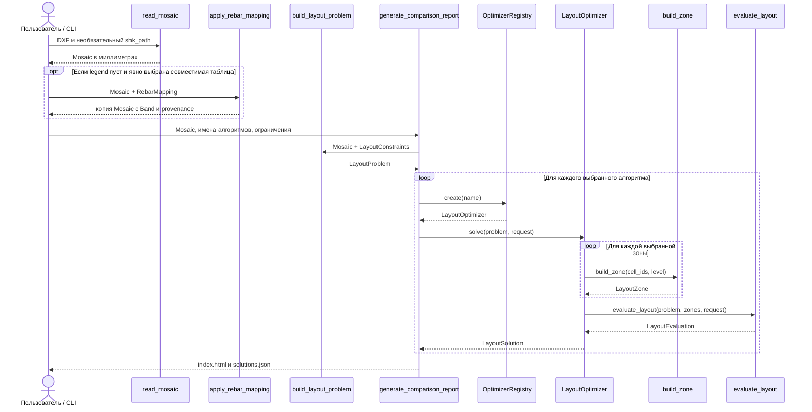
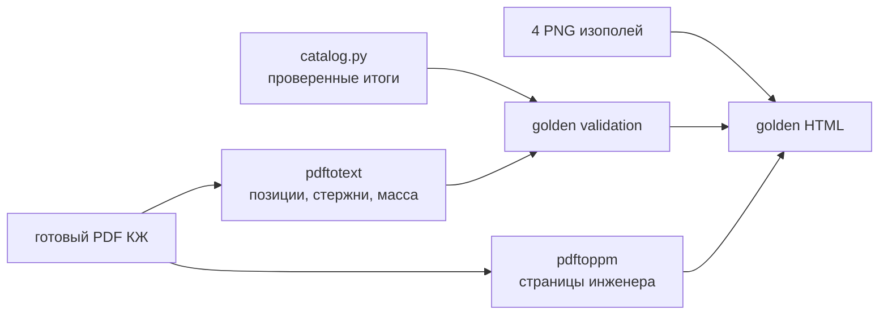

# Алгоритмы раскладки и устройство кода

Статус: baseline и memetic genetic search на 2026-08-28. Документ объясняет, какие алгоритмы уже есть,
как они принимают решения и через какие слои проекта проходят данные.

**13 сентября 2026:** [полный составной DXF web/CLI и эксперименты](composite-plate-workflow-2026-09-13.md).
Отдельный `composite-pool-milp/v1` подключён к четырём направлениям через
`analyze_composite_plate`; его ось позиций использует активацию типоразмеров в
`finite_cover`. Общеплитный DP сохраняет множества позиций до сборки всей плиты.
`stock_length_balance` минимизирует массу при выборе более длинных каталожных
компонентов и точных схем партии 11700; `stock_cutting` независимо перепроверяет
раскрой. Количества неизменны, лимит прироста по умолчанию +5%, геометрия пересчитывается.
Новая схема @100 — СТО 2.7.9 с касанием фона, отдельная непроверенная по Z политика.
Это не тюнинг старого GA и не завершённый Revit apply; сведения ниже датированы.

**9 сентября 2026:** для составных рецептов добавлен отдельный
[research-валидатор покрытия](composite-coverage-research-2026-09-09.md),
не новый оптимизатор. Он проверяет заданные зоны и фактические периодические оси;
составной поиск пока не подключён, несовместимый вход старого GA по-прежнему отклоняется.

Описанные ниже исходные методы решают задачу **одного направления армирования**. Их результат —
`LayoutSolution`, содержащий прямоугольные `LayoutZone`. Поле `detail_count` пока равно
числу зон, а `bar_count` хранит количество стержней внутри каждой зоны. Готовый
инженерный проект показал, что число зон, физических стержней и позиций спецификации
нужно выводить раздельно.

> **Важно:** все девять реализаций используют двухэтапную проверку. Пересечения
> `demand_bbox` разрешены; hard-условиями остаются полное покрытие геометрическим
> объединением зон достаточного уровня, минимальная ширина и корректные параметры.
> Envelope после `40d`, линии стержней и раздвижка крайних осей относятся к общей
> постобработке и не запускают forced merge. Методы остаются baseline и не гарантируют
> глобальный оптимум.
> Обоснование модели описано в
> [`layout-research-2026-08-19.md`](layout-research-2026-08-19.md).

## Архитектура пайплайна

```mermaid
flowchart LR
    subgraph Input["Входные данные"]
        DXF["DXF: 3DFACE + KLEENKA"]
        SHK[".shk: пороги As и арматура"]
        Manual["явная таблица<br/>для DXF без .shk"]
    end

    subgraph Ingest["Стадия A · ingest"]
        Reader["dxf_ingest.read_mosaic"]
        Mosaic["Mosaic<br/>одно направление"]
    end

    subgraph Preparation["Подготовка задачи"]
        Mapping["mappings.apply_rebar_mapping"]
        Adapter["adapters.mosaic"]
        Demand["DemandMap<br/>поле локальных требований"]
        Problem["LayoutProblem<br/>спрос + ограничения"]
    end

    subgraph Algorithms["Взаимозаменяемые алгоритмы"]
        Registry["OptimizerRegistry"]
        BBox["bbox"]
        BSP["bsp"]
        Greedy["greedy"]
        Priority["greedy-priority"]
        Agglomerative["agglomerative"]
        RowRun["row-run-greedy"]
        StripDP["strip-profile-dp"]
        Spatial["spatial-partition-greedy"]
    end

    subgraph Shared["Общие сервисы"]
        Guillotine["_guillotine<br/>допустимые разрезы"]
        Detailing["detailing.build_zone<br/>40d, ширина, стержни, масса"]
        SpatialDetailing["detailing.build_zone_from_bbox<br/>прямоугольник первичен"]
        Evaluation["evaluation.evaluate_layout<br/>union-покрытие, постобработка, метрики"]
        Bars["bar_geometry + phase<br/>оси, линии и общая фаза"]
    end

    subgraph Output["Проверка и представление"]
        Solution["LayoutSolution<br/>LayoutZone[] + зоны, стержни, масса"]
        JSON["solutions.json"]
        HTML["автономный HTML + inline SVG"]
        Revit["draft JSON выбранного кандидата<br/>plate-solution-revit/v1"]
    end

    DXF --> Reader
    SHK --> Reader
    Reader --> Mosaic
    Manual --> Mapping
    Mosaic --> Mapping
    Mosaic --> Adapter
    Mapping --> Adapter --> Demand --> Problem --> Registry
    Registry --> BBox
    Registry --> BSP
    Registry --> Greedy
    Registry --> Priority
    Registry --> Agglomerative
    Registry --> RowRun
    Registry --> StripDP
    Registry --> Spatial
    BSP -.-> Guillotine
    Priority -.-> Guillotine
    BBox -.-> Detailing
    BSP -.-> Detailing
    Greedy -.-> Detailing
    Priority -.-> Detailing
    Agglomerative -.-> Detailing
    RowRun -.-> Detailing
    StripDP -.-> Detailing
    Spatial -.-> SpatialDetailing
    SpatialDetailing -.-> Bars
    Detailing -.-> Bars
    BBox --> Evaluation
    BSP --> Evaluation
    Greedy --> Evaluation
    Priority --> Evaluation
    Agglomerative --> Evaluation
    RowRun --> Evaluation
    StripDP --> Evaluation
    Spatial --> Evaluation
    Bars -.-> Evaluation
    Evaluation --> Solution
    Solution --> JSON
    Solution --> HTML
    Solution -.-> Revit
```



Главное архитектурное правило: алгоритм выбирает разбиение, но не определяет собственные
формулы массы или собственную трактовку валидности. Методы используют общий
`build_zone` либо `build_zone_from_bbox`, а итог повторно проверяет общий
`evaluate_layout`. Исправление общей физической модели автоматически применяется ко
всем реализациям.

Фон SVG сохраняет исходные цвета мозаики через точное преобразование AutoCAD
`ACI -> RGB`; номер уровня не подменяется декоративной web-палитрой. Контуры выходных
зон используют отдельные контрастные цвета и не влияют на семантику исходных КЭ.

## Как проходит один запуск



Инженерный golden-case идёт параллельной веткой и не влияет на принятие решения
алгоритмом:



## Общий контракт алгоритма

Каждый алгоритм находится в отдельном модуле и реализует один интерфейс:

```python
class LayoutOptimizer(Protocol):
    name: str

    def solve(
        self,
        problem: LayoutProblem,
        request: AlgorithmRequest | None = None,
    ) -> LayoutSolution:
        ...
```

Вход:

- `LayoutProblem.demand` — КЭ, их геометрия и упорядоченные уровни требования;
- `LayoutProblem.constraints` — минимальная ширина, `40d`, режим перерасхода,
  разрешённый overlap и параметры постобработки;
- `AlgorithmRequest` — целевая функция, лимит зон, время и параметры эвристики.

Выход:

- `zones` — выбранные прямоугольные детали;
- `metrics` — масса, количество зон, покрытие и перерасход;
- `status` и `diagnostics` — прошёл ли результат общую проверку;
- `meta` — объяснение решения: разрезы, слияния и использованные аппроксимации.

## Сравнение реализованных алгоритмов

| Имя | Основная идея | Сильная сторона | Главное ограничение |
|-----|---------------|-----------------|----------------------|
| `bbox` | Одна сильная зона на весь спрос | Мгновенный baseline по числу зон | Максимальный перерасход |
| `bsp` | Лучший немедленно выгодный ортогональный разрез | Хорошо уменьшает массу на гильотинных разбиениях | Не делает временно невыгодные разрезы |
| `greedy` | Минимальные поперечные полосы с последующим слиянием | Быстрый и детерминированный | Не режет полосу вдоль направления стержней |
| `greedy-priority` | Разрез с учётом дорогих цветовых уровней | Пытается раньше изолировать сильный спрос | Всё ещё ограничен гильотинными разрезами |
| `agglomerative` | Связные пятна уровней и слияние ближайших зон | Быстрый bottom-up взгляд на задачу | Связность bbox и ближайшая пара — эвристики |
| `row-run-greedy` | Продольные интервалы спроса в поперечных строках | Локальные зоны и понятная жадная сборка | Начальные интервалы ограничиваются для больших сеток |
| `strip-profile-dp` | DP по последовательным поперечным полосам | Точный ответ внутри полосового класса | Не рассматривает произвольные двумерные разбиения |
| `spatial-partition-greedy` | Регулярная маска КЭ и безопасное укрупнение прямоугольников | Не создаёт overlap постфактум и хранит траекторию вариантов | Зависит от разрешения сетки и не гарантирует глобальный оптимум |

Ни один из них не гарантирует глобальный оптимум weighted rectangle cover. Это baseline
для проверки контрактов, визуализации и будущего сравнения с CP-SAT/MILP.

## `bbox`: одна охватывающая деталь

Файл: `src/rebar/optimization/algorithms/bbox.py`.

Алгоритм:

1. получает все КЭ с дополнительным армированием;
2. находит самый сильный уровень среди них;
3. строит один общий bbox;
4. передаёт его в `build_zone` для расчёта ширины, `40d`, числа стержней и массы;
5. проверяет результат через `evaluate_layout`.

Это программный аналог варианта с минимальным числом зон и обычно максимальной массой.
Называть его «Точкой 1» буквально можно только после уточнения единицы оси графика. Он
также служит гарантированным fallback текущей модели.

## `bsp`: жадное рекурсивное разбиение

Файл: `src/rebar/optimization/algorithms/bsp.py`.

Общая генерация разрезов находится в
`src/rebar/optimization/algorithms/_guillotine.py`.

Алгоритм начинает с одной зоны и перебирает вертикальные и горизонтальные разрезы между
соседними координатами центроидов. Для каждого разреза строятся две дочерние зоны. После
выбора листьев общий postprocessor назначает фазы и пытается раздвинуть крайние оси;
физический конфликт выдаёт предупреждение, но не объединяет листья.

Оставшиеся кандидаты оцениваются так:

```text
objective_gain = cost(parent) - cost(left) - cost(right)
cost(zone) = mass_weight × mass_kg + detail_penalty_kg
```

BSP выбирает максимальный положительный `objective_gain` и повторяет процесс до
`max_details` либо пока выгодных разрезов не останется. Метод жадный: он не выполнит
первый невыгодный разрез, даже если два последующих дали бы общий выигрыш.

## `greedy`: поперечные полосы

Файл: `src/rebar/optimization/algorithms/greedy.py`.

Алгоритм учитывает ориентацию стержней:

- для направления X полосы группируются по Y;
- для направления Y полосы группируются по X.

Ход работы:

1. КЭ группируются по одинаковым поперечным интервалам сетки.
2. Соседние интервалы собираются до минимальной ширины `min_width_cells`.
3. Пересекающиеся из-за нерегулярной сетки полосы принудительно объединяются.
4. Если полос больше `max_details`, соседние пары объединяются жадно: выбирается пара с
   наименьшим приростом целевой стоимости.
5. После выполнения лимита слияния продолжаются только тогда, когда сами улучшают цель.

Метод быстро покрывает весь спрос поперечными зонами и назначает им совместимую фазу, но
одна сильная ячейка может назначить сильный уровень всей длинной полосе.

## `greedy-priority`: сначала дорогие уровни

Файл: `src/rebar/optimization/algorithms/greedy_priority.py`.

Алгоритм использует те же допустимые разрезы, что BSP, но добавляет оценку цветового
перерасхода. Для каждой конфигурации арматуры сначала оценивается масса сетки на площадь:

```text
steel_density_kg_m2 = 6.165 × diameter² / step
```

Затем считается, сколько лишней массы возникает, когда слабым КЭ назначается самый
сильный уровень их общей зоны. Приоритет кандидата:

```text
selection_gain = objective_gain + priority_weight × avoided_overstrength_mass_kg
```

По умолчанию `priority_weight = 1.0`. Поэтому метод может предпочесть разрез, который
чуть хуже по непосредственной массе зон, но лучше отделяет редкие дорогие уровни.

Как и BSP, метод после разбиения вызывает общий postprocessor. Он назначает фазы и
пытается раздвинуть крайние оси, но разрешённые пересечения прямоугольников и
диагностические конфликты стержней не вызывают слияния.

## `agglomerative`: сборка снизу вверх

Файл: `src/rebar/optimization/algorithms/agglomerative.py`.

В отличие от BSP, алгоритм начинает не с одного большого прямоугольника, а с локальных
пятен спроса:

1. КЭ группируются по точному уровню армирования.
2. Внутри уровня связными считаются элементы, bbox которых касаются друг друга.
3. Для каждой компоненты строится отдельная зона общим `build_zone`.
4. В research-профиле пересечения зон разрешены и не вызывают обязательных слияний;
   production-семантика ждёт подтверждения технолога.
5. Если зон больше `max_details`, объединяются ближайшие пары.
6. Финальное решение проходит общую постобработку и независимо проверяется
   `evaluate_layout`.

Цвет здесь задаёт только начальные кластеры и не становится границей готовой детали:
после слияния прямоугольник может включать разные уровни и фон. Алгоритм похож на
агломеративную кластеризацию и не гарантирует минимальную массу, зато даёт быстрый
bottom-up baseline, принципиально отличный от top-down BSP. Очередь всех пар начальных
компонент требует `O(C²)` памяти, поэтому этот вариант пока рассчитан на диагностические
задачи с умеренным числом компонент, а не на неограниченный промышленный масштаб.

## Общая постобработка и детализация зоны

С 7 сентября 2026 существует отдельная ветка детализации **составных схем**:
`services/axis_patterns.py` и `services/composite_detailing.py`. Она сохраняет все
добавки, условный шаг и реальные периодические оси, пересчитывает каждый набор по
общим формулам. Это пока не вход встроенных оптимизаторов: `LayoutProblem` отклоняет
такие шкалы. `geometry_valid` составной зоны не равно старому `LayoutEvaluation.valid`:
покрытие КЭ и инженерные проверки составной схемы ещё не реализованы. См.
[`reinforcement-contract-v2-2026-09-07.md`](reinforcement-contract-v2-2026-09-07.md).

Файл: `src/rebar/optimization/services/detailing.py`.

`build_zone` выполняет одинаковую детерминированную постобработку для алгоритмов,
начинающих с групп КЭ.
`build_zone_from_bbox` использует те же формулы, но принимает уже построенный
пространственный прямоугольник. Поэтому spatial-алгоритму не приходится снова превращать
несвязный набор КЭ в один bbox.

Общая постобработка:

1. берёт bbox выбранных КЭ;
2. назначает переданный уровень арматуры;
3. отдельно сохраняет область спроса и требуемую рабочую длину вдоль стержней;
4. применяет заменяемую политику анкеровки, по умолчанию `40d` с двух сторон;
5. округляет длину вверх по выбранному каталогу отрезков либо оставляет непрерывной;
6. обеспечивает минимальную поперечную ширину и округляет её вверх до `k × step`;
7. задаёт первую ось, `bar_count = k + 1` и считает массу по принятой длине;
8. подбирает фазу и по возможности раздвигает крайние оси соседних зон;
9. фиксирует вклад зоны в покрытие КЭ и площадь перерасхода по service envelope.

Для оценки candidate/split алгоритмы вызывают тот же детерминированный расчёт заранее.
Это не переносит `40d` в геометрические hard-конфликты: стоимость кандидата просто сразу
соответствует его будущей финальной массе. После выбора решения расчёт повторяет общий
валидатор.

Для сбора покрытия `DetailingContext` хранит консервативный индекс bbox КЭ
(`services/spatial_index.py`). Он исключает только заведомо удалённые элементы:
пересечение оставшихся полигонов вычисляется прежним способом, исходный порядок КЭ
сохраняется. Hard-валидатор использует независимый полный расчёт. В GA кэш покрытия
собирается после подбора фаз; при ошибке подбора исходные зоны пересобираются с полным
кэшем. Последовательный A/B и границы вывода:
[`ga-performance-research-2026-09-06.md`](ga-performance-research-2026-09-06.md).

Минимальная ширина в КЭ пока переводится в миллиметры через медианный поперечный размер
элемента. После этого фактическая ширина всегда кратна шагу арматуры.

## Общая проверка результата

Файл: `src/rebar/optimization/services/evaluation.py`.

Валидатор не доверяет метрикам алгоритма и пересчитывает их заново. Он проверяет:

- известен ли уровень и соответствует ли ему арматура;
- согласованы ли demand bbox, первая/последняя ось, ширина, анкеровка и принятая длина;
- кратна ли ширина шагу и выполняется ли `bar_count = width / step + 1`;
- покрыта ли полная геометрия каждого требуемого КЭ геометрическим объединением зон
  достаточного уровня без двойного зачёта overlap;
- соблюдён ли `max_details`;
- разрешён ли найденный перерасход;
- если включён прежний строгий профиль — отсутствуют ли пересечения прямоугольников;
- какие пересечения установленного envelope, линий и нарушения зазора появились после
  детализации;
- не использует ли зона красную запрещённую позицию выбранного профиля А101;
- совпадает ли заявленная масса с независимым расчётом;
- каковы итоговые масса и значение целевой функции по пересчитанным значениям.

Зона разворачивается во временные линии `first_bar + i × step`; их не нужно хранить как
отдельные доменные сущности. Нарушения этого слоя имеют уровень `WARNING` и не изменяют
геометрическое решение. Для разных шагов MVP диагностирует консервативный больший шаг.
Spatial baseline уже запрещает слияние через сеточные плитки без `KLEENKA`; точный
векторный контур и семантика колонн/капителей ещё отсутствуют. Таблицы 2.4.2–2.4.4
оцифрованы отдельно в `rebar.standards`; отсутствие фактической позиции в рекомендательной
таблице остаётся `unknown`, а не неявным запретом.

## Реальный smoke-test и контроль пространственного разбиения

На `С1_t_800_Верхняя по оси У.dxf` с явной совместимой шкалой из девяти полос и
`max_details=8` получены следующие допустимые решения:

| Алгоритм | Зон | Физических стержней | Масса, кг |
|----------|----:|---------------------:|----------:|
| `bbox` | 1 | 160 | 6234,0 |
| `bsp` | 1 | 160 | 6234,0 |
| `greedy` | 2 | 153 | 5709,0 |
| `greedy-priority` | 1 | 160 | 6234,0 |
| `agglomerative` | 4 | 277 | 5290,4 |
| `row-run-greedy` | 1 | 160 | 6234,0 |
| `strip-profile-dp` | 1 | 160 | 6234,0 |

Все семь старых результатов получены строгим профилем и имеют непересекающиеся
`demand_bbox`; два предупреждения `agglomerative` относятся только к детализации после
`40d`. Эти цифры сохранены как исторический baseline. Пять методов всё ещё дают
одну зону, `greedy` — две, `agglomerative` — четыре. Одинаковые результаты при лимитах
8/16/32 показывают следующий независимый дефект: генераторы создают уже пересекающиеся
`demand_bbox` и затем сливают их. Этот вывод стал входом для spatial baseline ниже.
Старый smoke-test остаётся исторической диагностикой, а не инженерным эталоном.

Контрольный `spatial-partition-greedy` на том же C1 и `max_details=32`:

| Исходных пространственных прямоугольников | Итоговых зон | Физических стержней | Масса, кг | Недоминируемых точек траектории |
|---:|---:|---:|---:|---:|
| 190 | 32 | 993 | 6683,9 | 12 |

Недоармированных КЭ нет, итоговые `demand_bbox` не пересекаются как собственное свойство
этого алгоритма, а не как общий запрет. В отличие от старых
генераторов, алгоритм действительно проходит через множество допустимых состояний и
показывает их в web-графике. Число стержней пока заметно отличается от извлечённых из
КЖ 466 стержней; соответствие версии C1 и инженерного листа не доказано, а размер
регулярной сетки остаётся параметром чувствительности.

## Простые алгоритмы MVP

### `row-run-greedy`

Алгоритм строит интервалы спроса вдоль стержней для каждой поперечной строки КЭ,
собирает минимальную ширину, назначает фазу и сливает соседние группы только при выгодном
изменении общей стоимости. Это быстрый и объяснимый новый baseline.

### `strip-profile-dp`

Алгоритм перечисляет блоки последовательных поперечных полос и динамическим
программированием выбирает разбиение по массе и числу зон. Он не является глобально
точным решателем всей задачи, но даёт точный ответ внутри полосового класса и честную
контрольную точку для жадного метода.

### `spatial-partition-greedy`

Алгоритм находится в `optimization/algorithms/spatial_partition_greedy.py`:

1. выбирает шаги X/Y по медианным bbox-размерам КЭ и ограничивает общее число плиток;
2. помечает плитку разрешённой, если она пересекает хотя бы один полигон `KLEENKA`;
3. назначает плитке максимальный требуемый уровень среди пересекающих её КЭ;
4. собирает одинаковые соседние плитки в начальные непересекающиеся прямоугольники;
5. рассматривает ортогональных соседей, замыкает пересекаемые зоны в общий bbox и
   отклоняет слияние, если bbox проходит через запрещённую плитку;
6. выбирает слияние по приросту общей цели и сохраняет состояние после каждого шага;
7. выделяет недоминируемые точки внутри полученной жадной траектории.

Параметры исследования передаются через `AlgorithmRequest.params`:
`grid_cell_size_mm`, `maximum_grid_tiles`, `maximum_merges`,
`maximum_detail_reduction_per_merge` и `min_improvement_kg`.

Все три метода получают прежний `LayoutProblem`, возвращают `LayoutSolution` и не имеют
собственных формул валидности. CP-SAT/MILP в ближайший MVP не входит.

## Общий CandidateSet и Парето-фронт

`optimization/services/pareto.py` не является ещё одним генератором раскладки. Он
принимает результаты любых алгоритмов через общий контракт и:

1. повторно проверяет каждый `LayoutSolution` через `evaluate_layout`;
2. исключает ошибочные статусы и недопустимую геометрию до сравнения;
3. считает `ConstructabilityMetrics` без свёртки в произвольный score;
4. оставляет недоминируемые пары «масса ↔ явно выбранная сложность»;
5. комбинирует разные допустимые решения для `bottom/top × X/Y`; после добавления
   каждого направления сразу удаляет доминируемые частичные суммы, не материализуя
   полное декартово произведение;
6. повторяет Pareto-pruning на уровне `PlateSolution`.

Сейчас осью сложности можно явно выбрать число зон или физических стержней. Число
уникальных диаметров, шагов, установленных длин и сигнатур раскладки, а также
предупреждения показываются отдельно. Текущий фронт ограничен финальными решениями
выбранных baseline: это инфраструктура и сравнимый конечный фронт, но не claim
глобальной оптимальности.

## `genetic-pareto`: многокритериальный генетический поиск

`optimization/algorithms/genetic_pareto.py` реализует первый воспроизводимый GA по
рекомендации научного руководителя. Он возвращает не одну раскладку, а серию
`LayoutSolution` через дополнительный контракт `LayoutCandidateGenerator.solve_many()`.
Обычный `LayoutOptimizer.solve()` сохранён: он выбирает один представитель, поэтому
registry, отчёты и Revit-граница не зависят от типа метода.

Первая версия использует геном выбора прямоугольников из пространственного
`CandidateSet`:

1. регулярная маска и начальные атомы строятся теми же сервисами, что у
   `spatial-partition-greedy`;
2. несколько воспроизводимых merge-траекторий сохраняют выбранные и альтернативные
   допустимые bbox; начальное разбиение учитывает продольную ось стержней;
3. дополнительные послойные мосты позволяют слабой длинной зоне проходить под
   локальной сильной накладкой без повышения всего bbox до максимального уровня;
4. допустимые решения `bsp`, `greedy-priority` и `agglomerative` добавляются в
   CandidateSet и начальную популяцию без изменения геометрии; сеточные индексы нужны
   только для соседства;
5. атом repair — отдельная требуемая плитка сетки, а не длинный исходный run; плитка
   засчитывается только при полном вхождении в реальный `demand_bbox` достаточной зоны;
6. хромосома — множество индексов прямоугольников CandidateSet;
7. crossover смешивает множества родителей, а предметные мутации выполняют
   `split`, `merge`, `shift`, `change-level` и `baseline-patch`;
8. политика `ucb1` по умолчанию онлайн распределяет попытки между операторами по
   ограниченному reward улучшения двух Парето-целей; `uniform` оставлен контролем;
9. детерминированный repair закрывает все исходные атомы, удаляет избыточные гены и
   пытается уложиться в `max_details`;
10. NSGA-II-подобный ranking и crowding одновременно минимизируют массу и явно выбранную
   ось сложности: `zone_count` либо `physical_bar_count`;
11. внешний архив сохраняет недоминируемые точки по внутренним метрикам; окончательная
   допустимость определяется после детализации, поэтому сам архив не является
   сертификатом монотонного улучшения hard-valid фронта;
12. финальные особи материализуются через общий builder, проходят фазирование и затем
   полностью перепроверяются `evaluate_layout`;
13. внешний `build_direction_pareto_front` повторно удаляет невалидные, доминируемые и
   эквивалентные результаты.

Параметры в `AlgorithmRequest.params`: `population_size` (16), `generations` (30),
`random_seed` (42), `crossover_rate` (0.85), `mutation_rate` (0.35),
`candidate_window` (6), `candidate_trajectories` (3), `layer_bridge_span` (6),
`maximum_detail_reduction_per_merge` (12), `maximum_pool_merges` (5000) и
`complexity_axis`, `operator_policy` (`ucb1`), `ucb_exploration` (`√2`) и
`baseline_seed_algorithms`. Исследовательские флаги: `candidate_expansion`
(`none`/`layered`, по умолчанию `none`), `maximum_layer_variants` (256),
`local_search_passes` (4, 0 — контроль без локальных замен). `genetic/candidates.py` добавляет ограниченные
варианты слабых оболочек; `genetic/local_search.py` предлагает неухудшающие замены
внутри пула. Родители локального поиска сохраняются до независимой проверки.
Бюджет локальных проверок и отбраковки финального архива записываются отдельно.
Основной `coverage_atoms=demand_fragments` уточняет плитки по границам несеточных
baseline-зон и определяет локальные уровни через пересечения с полигонами КЭ;
`whole_tiles` оставлен консервативным контролем. Не меняет геометрию кандидатов.
Предел уточнённой дискретизации — 50000 атомов, с явным отказом при превышении.
Одинаковые
вход, параметры и seed без wall-clock остановки дают одинаковый фронт. Если пользователь не задаёт cap зон,
application-слой использует естественный максимум — общее число КЭ направления.

Усиленный opt-in профиль: `pool_polish='milp'`, `pool_polish_solves=6`,
`pool_polish_time_s=10.0`, `recombination_variants=1500`. `genetic/recombination.py`
добавляет геометрическое скрещивание соседей и заново уточняет атомы по новым границам;
`genetic/pool_solver.py` выполняет ограниченную целочисленную перекомбинацию всего пула
по нескольким бюджетам сложности. Это гибрид GA+MILP, а не доказательство улучшения
самих мутаций или UCB. Нужен extra `solver`; default остаётся `none/0`.
Все предложения идут в общий hard-валидатор вместе с родителями. Time limit может
менять найденный incumbent, даже при одинаковом seed. Числа и ограничения:
[`ga-hybrid-research-2026-09-06.md`](ga-hybrid-research-2026-09-06.md).

UCB — адаптивная hyper-heuristic, а не модель, обученная на инженерном датасете. Она
учится только внутри запуска выбирать полезную следующую мутацию. Геометрию создают
фиксированные операции, а hard-repair и валидатор не входят в reward и не могут быть
«выкуплены» улучшением массы. Код разделён на
`algorithms/genetic/operators.py`, `algorithms/genetic/policy.py` и публичную
оркестрацию `genetic_pareto.py`.

Исторический эксперимент 28 августа показал, что пять seed дают один минимум, а увеличение одного
merge сверх 12 зон не улучшает результат. Это не доказывало отсутствие потерь поиска:
проверка H6 от 5–6 сентября обнаружила разрыв даже внутри прежнего конечного пула.
В августовской постановке общий портфель baseline уже проходил
экономический гейт плиты нуля с отклонением массы +8,00%; подробности и состав по
направлениям приведены в [`genetic-experiments.md`](genetic-experiments.md).

Benchmark сравнивает `uniform` и `ucb1` при одинаковых population/generations/seed,
сохраняет выборы и mean reward каждого оператора и считает нормализованный 2D
hypervolume по общим границам серии. Это позволяет проверять пользу адаптации без
cherry-picking одного кандидата.

Короткий plate-zero A/B на seed `7/17/42` сохранил массу `3424,34 кг` (`+7,76%` к
golden) и нулевое недоармирование во всех шести запусках. Медианный hypervolume:
`0,67431` для uniform и `0,67417` для UCB1; превосходство адаптации пока не доказано.
Полные условия и таблица находятся в [`genetic-experiments.md`](genetic-experiments.md).

По продуктовому решению от 21 августа текущий набор baseline заморожен: до первого
воспроизводимого GA-сравнения не добавляем ещё один простой deterministic-метод и не
подменяем исследовательский шаг ручным тюнингом коэффициентов.

Серия экспериментов запускается через `scripts/benchmark_genetic.py`; она фиксирует
полную сетку параметров и seed, число исходных/отклонённых кандидатов, гейты и
абсолютные/относительные дельты к golden. Форматы результата описаны в
[`genetic-experiments.md`](genetic-experiments.md).

## Сравнение с решением инженера

`src/rebar/golden/` хранит первый воспроизводимый эталон плиты нуля. Он не пытается
распознать геометрию стержней из растра: из текстового слоя страниц 8-11 извлекаются
строки спецификаций, а сами страницы рендерятся только для визуального просмотра.

Проверенные итоги четырёх направлений:

```text
79 позиций · 1019 физических стержней · 3177,64 кг
```

Запуск `python3 scripts/verify_golden_case.py` создаёт автономный HTML с четырьмя
входными изополями и четырьмя листами инженера. Полный контракт, сопоставление страниц и
ограничения описаны в [`golden-case.md`](golden-case.md). Будущее сравнение геометрии
должно получать данные из DWG→DXF и оставаться вне модулей алгоритмов.

## Как запустить сравнение

```bash
python3 scripts/compare_optimizers.py \
  "Дополнительные материалы/Нижнее армирование вдоль ОСИ У.dxf" \
  --algorithms spatial-partition-greedy bbox bsp greedy agglomerative \
  --out-dir artifacts/comparison
```

Результат:

- `artifacts/comparison/index.html` — автономная визуализация всех решений;
- `artifacts/comparison/solutions.json` — общий машиночитаемый контракт.

Программный выбор:

```python
from rebar.optimization import AlgorithmRequest, built_in_optimizer_registry

registry = built_in_optimizer_registry()
optimizer = registry.create("agglomerative")
solution = optimizer.solve(
    problem,
    AlgorithmRequest(max_details=8),
)
```

## Exact-oracle для контроля GA

Для проверки генетического поиска, а не для генерации production-раскладки,
добавлен отдельный точный эталон малого конечного CandidateSet. Команда
`python3 scripts/benchmark_genetic_oracle.py` запускает открытые маски X/Y,
равнобюджетные uniform/UCB1 и показывает gap по массе и бюджетам зон/стержней.
Перебор не использует GA repair или его Парето-отбор; детализация и hard-проверки
остаются общими. Неполный перебор не выдаётся за точный результат. Подробности —
в [`genetic-experiments.md`](genetic-experiments.md).

## Как добавить новый алгоритм

1. Создать отдельный файл в `optimization/algorithms/`.
2. Реализовать `name` и `solve(problem, request)`.
3. Использовать общие `build_zone` и `evaluate_layout`.
4. Зарегистрировать класс в `built_in_optimizer_registry()`.
5. Экспортировать его через `optimization/algorithms/__init__.py` и публичный
   `optimization/__init__.py`.
6. Добавить контрактный тест, X/Y-тест при зависимости от направления и прогон на
   реальном DXF.
7. Подключить имя к HTML-сравнению и описать ограничения в этом документе.

CP-SAT/MILP должен добавляться по тому же контракту. Он не заменяет общие сервисы и не
получает права обходить инженерный валидатор.

## Составная схема: отдельный исследовательский поиск

`composite-pool-milp/v1` (10 сентября) использует новый `CompositeSearchProblem`, а не
несовместимый одиночный `LayoutProblem`. Он пока доступен через
`scripts/optimize_composite_layout.py`, **не** через прежний registry/web.
Пул пространственных прямоугольников сохраняет все упорядоченные добавки, стоимость
считается по фактическим периодическим осям после 40d/раскроя; solver выбирает полное
покрытие КЭ при лимитах числа зон. Каждая точка независимо проверяется общими сервисами.
Это подключение отсутствовавшего составного контракта, не новый тюнинг старых baseline.

Default — ближайшая к идеалу точка конечного mass/zone-count фронта с равными
нормированными весами; инженерная «Точка 3» не утверждается. Host-профиль может
выдавать диагностику или строго исключать известные нарушения. При краевом
противоречии 40d/cover поиск останавливается без попытки обрезать стержни.
Все результаты `research-only`, `placement_eligible=false`.
[Контракт, результаты и ограничения](composite-search-host-2026-09-10.md).

Опциональный `interior-exceptions` добавляет фиксированный внутренний прямоугольник
для всех разрешённых рецептов; целые краевые КЭ остаются исключениями и в полном
coverage. Общий `services/composite_interior.py` учитывает продольные 40d/cover и
поперечные фазы/радиусы. Поиск не изменяет исходный размер КЭ для минимальной ширины.
Конфликты зон одного направления теперь входят в host-aware MILP; независимые лимиты
массы/числа физических стержней проверяются также после детализации, лимит длины не
создаёт стыки автоматически. Этот профиль не включён в старый web/GA и не доказывает
пригодность внутреннего результата. На настоящем входе 384/1024 дали одну тяжёлую
зону, 131 остаточный КЭ и отсутствие решений при контрольных ограничениях качества.
[Подробный отрицательный эксперимент и следующий шаг](composite-interior-research-2026-09-10.md).

### Фрагментное покрытие — 11 сентября

Опциональный `--algorithm fragment-grid` использует отдельный
`algorithms/composite_partition.py`: атомы — положительные пересечения полигонов
целевых КЭ с фиксированной сеткой, не центры/цветовые компоненты. Гильотинное DP
сравнивает целую зону и два разрезанных подпрямоугольника по
`масса + lambda*зоны + mu*физические стержни`. Обязательные добавки сохраняются,
стоимость после 40d/раскроя берётся из общих сервисов. Ограничения массы/числа
фильтруют завершённые скалярные решения; sweep может пропустить допустимую точку.
Исходный полный coverage и host проверяются независимо. Локальный кеш размера КЭ
ускоряет кандидатов, но не передаётся окончательному checker.

Новый поиск дал 9,37 т / 421 стержень / 19 зон на тех же 1210 внутренних КЭ,
со стержнями до 11,34 м. Это research-результат: 131 исходный КЭ остаётся неполным,
а при одинаковых глубинах добавок между зонами возникают коллизии. Проекции таких
конфликтов теперь видимы и при неизвестном Z. [Статьи, серии и ограничения](composite-fragments-research-2026-09-11.md).

### Совместимость разрезов и глубин — продолжение 11 сентября

`fragment-grid` теперь имеет явное начало внутренних поперечных линий
`--across-origin-mm`; границы исходной области и все target КЭ сохраняются.
Согласование линий `300+900k` с экспериментальной фазой второй добавки 150 уменьшает
дублирование граничных осей. Первая схема относительно фона остаётся неизменной.

Отдельный `algorithms/composite_joint_depths.py` решает конечную задачу назначения
глубин наборов. `services/composite_joint_graph.py` находит минимальные расстояния
пар осей в XY; CSP проверяет допустимые пары глубин, фиксированные высоты, cover и
явно заданный порядок добавок. Все готовые назначения проходят независимый полный
coverage/host; массу, фазы и 40d глубинный поиск не меняет. Его гарантия ограничена
минимумом максимальной глубины в переданном каталоге, не прочностью и не технологией.

CLI `experiment_composite_joints.py` не подменяет старый экспорт и ничего не размещает.
На Top X найдено 16 зон / 387 стержней / 9,21 т с нулём коллизий добавок при явных
глубинах и зазоре 25 мм. Это исследовательские допущения: 48 Ø18 имеют глубину 77 мм,
рабочая высота, край и физические узлы ещё требуют решения конструктора.
[Итерации, отрицательные контроли и воспроизведение](composite-joints-research-2026-09-11.md).

### Физическая нормализация — 13 сентября

`algorithms/physical_normalization.py` — opt-in постобработка полного набора
фактических осей, не новый `LayoutOptimizer` и не замена параметрических зон.
При явно разрешённом повышении Ø объединяет обязательные интервалы с полными
40d нового диаметра, сохраняя все исходные ссылки. Длинные цепочки объединяет
только частично; невозможный единый стержень >11700 мм не обрезается.
Далее проверяет/балансирует партию, сдвигает стержни вдоль оси в пределах
остатка длины и пробует ограниченные обмены длин одинакового диаметра/класса.
Исходные поперечные оси, класс, контакт с фоном и спрос не меняются.

Цель конечного выбора — stock/cap-допустимость, затем меньше пересекающихся пар,
масса и число стержней; это конечная эвристическая траектория. При исчерпании
бюджета возвращается полный проверенный промежуточный вариант, а не частичная
партия. Все пары независимо пересчитываются и передаются с конкретными ID.
Прежний source `LayoutZone` остаётся в отчёте, исполнительные группы имеют
отдельный счётчик. [Автоматическая цепочка и контроль](automatic-assistant-pipeline-2026-09-13.md).

### Совместный FE-based host repair — 14 сентября

`algorithms/fe_host_repair.py` — отдельный фиксированный по осям физический поиск,
не новый генератор LayoutZone. MILP выбирает по одному положению каждого стержня,
сохраняя весь инвентарь длин/диаметров/стали и ограничения совместных коллизий.
Обязательные интервалы по всем исходным обслуживаемым КЭ вычисляет независимый
сервис до поиска; полные 40d сохраняются. Цели: минимум host-отказов, затем числа
изменённых стержней и суммы перемещений концов. При нехватке бюджета выдаётся
только полный исходный или ранее проверенный вариант.

Реальная серия: 405 → 383 при прежних длинах, **405 → 371** при обмене существующих
длин. 902 стержня, 2989,953486 кг, 25 позиций, полное исходное FE-покрытие и раскрой
сохранены; 12 прежних пар остаются. Увеличение лимита пула 96 → 256 → 512 не улучшило
метрики, последний пул не усечён. Это не разрешение Revit-размещения и не глобальный
оптимум переразбиения зон. [Эксперименты и воспроизведение](fe-host-repair-2026-09-14.md).

### Несимметричные зоны и host-фильтр GA — 14 сентября

`genetic/host_filter.py` реализует опциональный `candidate_guard`: фильтр всех
источников кандидатов до эволюции, сохранение исходных атомов покрытия, повторная
проверка после материализации/фаз. Пул, не покрывающий все атомы, явно отклоняется;
никакой части спроса это не удаляет. [Контрольный опыт](host-constrained-genetic-2026-09-14.md).

`services/composite_zone_translation.py` генерирует поперечные сдвиги окна выбора
при неизменных глобальных STO-фазах и количестве физических стержней. Сохраняются
все исходные достаточные FE-фрагменты каждой зоны; длины и ширина прежние.
`fit_composite_zone_to_solid_host` находит общий продольный сдвиг всех компонентов
в точном Solid с проёмами, сохраняя полные40d. Общий слой не требует, чтобы центр
установленной длины совпадал с центром требуемого участка.

`application/asymmetric_zone_shift.py` совместно оценивает эти предложения на полном
комплекте. Конечная жадная траектория уменьшает число host-отказов, затем пересечений;
новые пары и увеличение/перенос существующих областей пересечения запрещены.
Покрытие и ведомость всего комплекта повторно проверяются после каждого принятого
сдвига. Не найденное перемещение сохраняет исходную зону с диагностикой.
Метод подключается перед физической нормализацией и не переносит старые сертификаты
осей на новую геометрию. [Описание и запуск](asymmetric-zone-shift-2026-09-14.md).

### Экспериментальные физические оси и пересечения — 14 сентября

В отдельном конечном опыте `experiment_fe_transverse_repair.py` выбираются
поперечные координаты при неизменных концах и полном инвентаре. Независимый
одноимённый сервис проверяет все положительные FE-части каждого прежнего
владельца, полные 40d, фон и совместность. На рабочей плите девять сдвигов дали
369 → **360** host-отказов без изменения 902 стержней и массы 2989,953486 кг.

`experiment_collision_replacement.py` исследует соосное слияние и замену одного
стержня двумя касательными по сторонам. Балансировка каталожных длин касается
только новых потомков; затем независимо проверяются полный FE-спрос, сохранение
прежних частей владельцев и раскрой. После девяти сдвигов: **912 стержней /
3028,326912 кг / 27 позиций / 0 пар одного направления**, но **361 host-отказ**.
Это исследовательская альтернатива с явно отмеченным ухудшением host на один,
не производственно допустимая укладка. Глобальный оптимум, исходные STO-фазы,
прямоугольная перегруппировка и реальные Z не подтверждены.
[Проверки, точные артефакты и несовместимые условия края](edge-resolution-2026-09-14.md).

### Полное исходное покрытие и рабочие U-формы — ночная серия 14 сентября

`algorithms/shaped_global_repair.py` исследует поперечный сдвиг и замену прямого
стержня канонической U-формой из инженерского комплекта. Сохраняются диаметр,
сталь, число и настоящая раскройная длина каждого стержня. Зона обслуживания
может перейти другому достаточному стержню: сохранение каждого прежнего
владельца не требуется, но весь исходный FE-спрос проверяется заново.
`services/shaped_global_coverage.py` независимо проверяет нулевую потерю площади,
весь Solid с защитным слоем, фон, полные 3D-пары и раскрой. Возврат и дуги не
получают кредит покрытия. У изменённых стержней запрещены как доказанные, так
и неопределённые пары коллизий.

Первый ограниченный поиск: **370 → 295** строгих host-отказов, 76 изменений,
61 U-форма; **902 стержня / 2989,953486 кг / 38 позиций**. Новых 3D-пар нет,
у изменённых стержней конфликтов нет; исходные оставшиеся нарушения не скрыты.
Бюджет 180 секунд исчерпан — это промежуточный результат, не оптимум и не
разрешение размещения. Разница 370/369 с прежней XY-проверкой обусловлена более
строгой проверкой тела, а не другим входным инвентарём.

Перенос потребности — отдельный эксперимент `services/demand_transfer.py`:
сохраняет исходные КЭ и поперечный интеграл добавочной стали, затем независимо
проверяет покрытие преобразованной карты. Он **не подключён** к этому поиску
как молчаливая замена исходного FE. [Проверка теории](theory-audit-2026-09-14.md)
отделяет сохранение бюджета от инженерной эквивалентности и геометрию U от
расчёта несущей способности анкеровки.

Опциональный `maximum_longitudinal_shift_mm` включает сдвиг **целого** прямого
стержня. `shaped_translation_candidates.py` пересекает точные host-интервалы
с необходимыми интервалами исходного FE; финальный независимый валидатор
проверяет явно заданный предел сдвига и ту же длину. По умолчанию предел нулевой.
Серия с лимитом 100000 кандидатов дала 289 host-отказов и 35 позиций при прежних
902 стержнях и массе; 11 исходных пар не исправлены. Это не готовая укладка.

Совместный конечный поиск (`shaped_joint_repair.py`) выбирает q/U и, при явном
включении, продольные положения и обмен существующими длинами. Ровно один кандидат
на исходный стержень, точное сохранение инвентаря длин по направлению/диаметру/стали,
затем повторная проверка всей площади FE и всех 3D-пар. Точечные MILP-ограничения
не являются финальным гейтом: непокрытые полигоны порождают новые ограничения.
Первый q/U-пул дал 296 отказов и не заменил вариант с 289; серия обмена длинами
проводится отдельно. Наличие нового метода в коде не означает его готовность
к автоматической конструктивной выдаче или размещению в Revit.
### Отдельный поиск разбиений `zone-merge` — 18 сентября

`algorithms/composite_merge.py` строит три пространственные иерархии соседних
слияний, а в новом `zone-merge` включает четвёртую с разрезом по крупнейшему
промежутку между центроидами КЭ. DP сохраняет альтернативы по числу зон;
ограниченное соседнее улучшение расширяет только конечный набор кандидатов. Независимые сервисы
детализации и покрытия повторно проверяют исходные КЭ и установленные 40d.
Общеплитный DP использует до 16 точек каждого направления и показывает
ограниченный фронт «масса ↔ зоны». Рецепт monotone-component — явный
исследовательский профиль, не молчаливая замена прежнего `positions`.
Геометрическое колено и слабая ridge-рекомендация — разные способы выбора
готовой точки. [Постановка, baseline v1 и воспроизведение](zone-partition-experiment-2026-09-18.md).
Серия v3 улучшила минимальную массу трёх проверенных полных плит относительно
v2 при меньшем числе зон; это не доказательство глобальной оптимальности.
