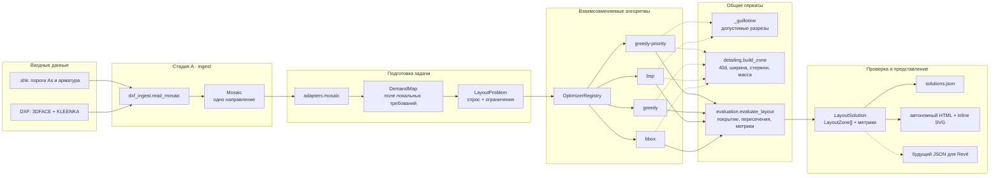
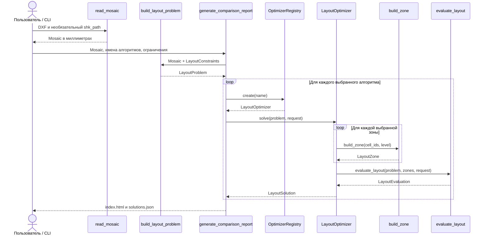

# Алгоритмы раскладки и устройство кода

Статус: baseline-реализации на 2026-08-18. Документ объясняет, какие алгоритмы уже есть,
как они принимают решения и через какие слои проекта проходят данные.

Все текущие методы решают задачу **одного направления армирования**. Их результат —
`LayoutSolution`, содержащий прямоугольные `LayoutZone`. Одна зона считается одной
деталью, а `bar_count` хранит количество стержней внутри неё.

## Архитектура пайплайна



Главное архитектурное правило: алгоритм выбирает разбиение, но не определяет собственные
формулы массы или собственную трактовку валидности. Все методы используют общий
`build_zone`, а итог повторно проверяет общий `evaluate_layout`.

## Как проходит один запуск



## Общий контракт алгоритма

Каждый алгоритм находится в отдельном модуле и реализует один интерфейс:

```python
class LayoutOptimizer(Protocol):
    name: str

    def solve(
        self,
        problem: LayoutProblem,
        request: AlgorithmRequest | None = None,
    ) -> LayoutSolution:
        ...
```

Вход:

- `LayoutProblem.demand` — КЭ, их геометрия и упорядоченные уровни требования;
- `LayoutProblem.constraints` — минимальная ширина, `40d`, режим перерасхода и
  пересечений;
- `AlgorithmRequest` — целевая функция, лимит деталей, время и параметры эвристики.

Выход:

- `zones` — выбранные прямоугольные детали;
- `metrics` — масса, количество деталей, покрытие и перерасход;
- `status` и `diagnostics` — прошёл ли результат общую проверку;
- `meta` — объяснение решения: разрезы, слияния и использованные аппроксимации.

## Сравнение реализованных алгоритмов

| Имя | Основная идея | Сильная сторона | Главное ограничение |
|-----|---------------|-----------------|----------------------|
| `bbox` | Одна сильная зона на весь спрос | Мгновенный нижний baseline по числу деталей | Максимальный перерасход |
| `bsp` | Лучший немедленно выгодный ортогональный разрез | Хорошо уменьшает массу на гильотинных разбиениях | Не делает временно невыгодные разрезы |
| `greedy` | Минимальные поперечные полосы с последующим слиянием | Быстрый и детерминированный | Не режет полосу вдоль направления стержней |
| `greedy-priority` | Разрез с учётом дорогих цветовых уровней | Пытается раньше изолировать сильный спрос | Всё ещё ограничен гильотинными разрезами |

Ни один из них не гарантирует глобальный оптимум weighted rectangle cover. Это baseline
для проверки контрактов, визуализации и будущего сравнения с CP-SAT/MILP.

## `bbox`: одна охватывающая деталь

Файл: `src/rebar/optimization/algorithms/bbox.py`.

Алгоритм:

1. получает все КЭ с дополнительным армированием;
2. находит самый сильный уровень среди них;
3. строит один общий bbox;
4. передаёт его в `build_zone` для расчёта ширины, `40d`, числа стержней и массы;
5. проверяет результат через `evaluate_layout`.

Это программный аналог «Точки 1»: минимальное количество деталей, обычно максимальная
масса. Он также служит гарантированным fallback текущей модели.

## `bsp`: жадное рекурсивное разбиение

Файл: `src/rebar/optimization/algorithms/bsp.py`.

Общая генерация разрезов находится в
`src/rebar/optimization/algorithms/_guillotine.py`.

Алгоритм начинает с одной зоны и перебирает вертикальные и горизонтальные разрезы между
соседними координатами центроидов. Для каждого разреза строятся две дочерние зоны. Кандидат
отбрасывается, если он создаёт запрещённое пересечение.

Оставшиеся кандидаты оцениваются так:

```text
objective_gain = cost(parent) - cost(left) - cost(right)
cost(zone) = mass_weight × mass_kg + detail_penalty_kg
```

BSP выбирает максимальный положительный `objective_gain` и повторяет процесс до
`max_details` либо пока выгодных разрезов не останется. Метод жадный: он не выполнит
первый невыгодный разрез, даже если два последующих дали бы общий выигрыш.

## `greedy`: поперечные полосы

Файл: `src/rebar/optimization/algorithms/greedy.py`.

Алгоритм учитывает ориентацию стержней:

- для направления X полосы группируются по Y;
- для направления Y полосы группируются по X.

Ход работы:

1. КЭ группируются по одинаковым поперечным интервалам сетки.
2. Соседние интервалы собираются до минимальной ширины `min_width_cells`.
3. Пересекающиеся из-за нерегулярной сетки полосы принудительно объединяются.
4. Если полос больше `max_details`, соседние пары объединяются жадно: выбирается пара с
   наименьшим приростом целевой стоимости.
5. После выполнения лимита слияния продолжаются только тогда, когда сами улучшают цель.

Метод быстро покрывает весь спрос непересекающимися поперечными зонами, но одна сильная
ячейка может назначить сильный уровень всей длинной полосе.

## `greedy-priority`: сначала дорогие уровни

Файл: `src/rebar/optimization/algorithms/greedy_priority.py`.

Алгоритм использует те же допустимые разрезы, что BSP, но добавляет оценку цветового
перерасхода. Для каждой конфигурации арматуры сначала оценивается масса сетки на площадь:

```text
steel_density_kg_m2 = 6.165 × diameter² / step
```

Затем считается, сколько лишней массы возникает, когда слабым КЭ назначается самый
сильный уровень их общей зоны. Приоритет кандидата:

```text
selection_gain = objective_gain + priority_weight × avoided_overstrength_mass_kg
```

По умолчанию `priority_weight = 1.0`. Поэтому метод может предпочесть разрез, который
чуть хуже по непосредственной массе зон, но лучше отделяет редкие дорогие уровни.

Ограничение остаётся жёстким: если после учёта минимальной ширины и выпусков `40d` две
дочерние зоны пересекаются, разрез не рассматривается. На реальном нижнем X при запрете
пересечений не оказалось ни одного допустимого первого разреза, поэтому и BSP, и
`greedy-priority` корректно вернули одну деталь.

## Общая детализация зоны

Файл: `src/rebar/optimization/services/detailing.py`.

`build_zone` выполняет одинаковые действия для всех алгоритмов:

1. берёт bbox выбранных КЭ;
2. назначает переданный уровень арматуры;
3. определяет рабочую длину вдоль стержней;
4. добавляет с двух сторон `anchorage_diameters × diameter`;
5. обеспечивает минимальную поперечную ширину;
6. считает `bar_count` и массу;
7. фиксирует накрытые и избыточно накрытые КЭ.

Текущая MVP-формула количества — `ceil(width / step) + 1`. В дальнейшем ширина должна
сначала приводиться строго к `k × step`, после чего количество станет `k + 1`.

## Общая проверка результата

Файл: `src/rebar/optimization/services/evaluation.py`.

Валидатор не доверяет метрикам алгоритма и пересчитывает их заново. Он проверяет:

- известен ли уровень и соответствует ли ему арматура;
- согласованы ли bbox, ширина и установленная длина;
- покрыты ли все требуемые КЭ достаточным уровнем;
- соблюдён ли `max_details`;
- разрешён ли найденный перерасход;
- отсутствуют ли пересечения зон;
- каковы итоговые масса и значение целевой функции.

Статус `FEASIBLE` означает допустимость только относительно текущей MVP-модели. Точная
геометрия КЭ, зазор на шаг, проёмы и Таблица 2.4.2 ещё должны усилить общий валидатор.

## Текущий диагностический результат

На реальном нижнем армировании по Y при `max_details=8` и запрете пересечений:

| Алгоритм | Деталей | Масса, кг | Недоармированных КЭ |
|----------|---------|-----------|---------------------|
| `bbox` | 1 | 14 611 | 0 |
| `bsp` | 8 | 5 726 | 0 |
| `greedy` | 2 | 13 908 | 0 |
| `greedy-priority` | 8 | 5 726 | 0 |

Это не инженерный эталон: покрытие пока проверяется по центроидам, а ширина использует
медианный размер КЭ. Таблица нужна для регрессионного сравнения baseline на одной модели.

## Как запустить сравнение

```bash
python3 scripts/compare_optimizers.py \
  "Дополнительные материалы/Нижнее армирование вдоль ОСИ У.dxf" \
  --algorithms bbox bsp greedy greedy-priority \
  --max-details 8 \
  --out-dir artifacts/comparison
```

Результат:

- `artifacts/comparison/index.html` — автономная визуализация всех решений;
- `artifacts/comparison/solutions.json` — общий машиночитаемый контракт.

Программный выбор:

```python
from rebar.optimization import AlgorithmRequest, built_in_optimizer_registry

registry = built_in_optimizer_registry()
optimizer = registry.create("greedy-priority")
solution = optimizer.solve(
    problem,
    AlgorithmRequest(
        max_details=8,
        params={"priority_weight": 1.0},
    ),
)
```

## Как добавить новый алгоритм

1. Создать отдельный файл в `optimization/algorithms/`.
2. Реализовать `name` и `solve(problem, request)`.
3. Использовать общие `build_zone` и `evaluate_layout`.
4. Зарегистрировать класс в `built_in_optimizer_registry()`.
5. Экспортировать его через `optimization/algorithms/__init__.py` и публичный
   `optimization/__init__.py`.
6. Добавить контрактный тест, X/Y-тест при зависимости от направления и прогон на
   реальном DXF.
7. Подключить имя к HTML-сравнению и описать ограничения в этом документе.

CP-SAT/MILP должен добавляться по тому же контракту. Он не заменяет общие сервисы и не
получает права обходить инженерный валидатор.
