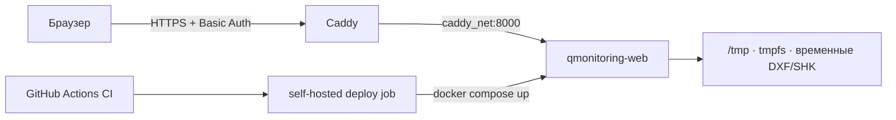

# Production-деплой web-MVP

Web-MVP запускается одним Docker Compose-сервисом и подключается к уже существующей
внешней сети Caddy. Порт приложения не публикуется на хосте: единственная публичная
точка входа — Caddy с HTTPS и Basic Auth.

## Архитектура



Контейнер запускается непривилегированным пользователем, с read-only root filesystem.
Файлы синхронного запроса удаляются после ответа; файлы фонового задания и результат
удаляются после часового срока хранения. В `tmpfs` выделено 256 МБ; HTTP-слой
дополнительно ограничивает каждый загружаемый файл 30 МБ.

## Что требуется на сервере

1. Linux self-hosted GitHub Runner с метками `self-hosted` и `linux`.
2. Docker Engine и Docker Compose v2.
3. Пользователь runner имеет доступ к Docker daemon.
4. Запущенный Caddy Compose уже создал сеть `caddy_net`.

Проверка сети:

```bash
docker network inspect caddy_net
```

Если Caddy ещё ни разу не запускался, сеть создаст его Compose-конфигурация с
`name: caddy_net`. Вручную создавать вторую сеть с другим именем не нужно.

## Автоматический деплой

Обычный workflow `CI` запускает Ruff, pytest, compileall, сборку wheel, проверку Compose
и сборку production-образа на GitHub-hosted runner. После успешного `push` в `main`
workflow `Deploy`:

1. получает точный SHA, который прошёл CI;
2. проверяет Docker и наличие `caddy_net`;
3. собирает образ и при явно настроенном источнике устанавливает проверенные DXF;
4. выполняет `docker compose up --detach --no-build --remove-orphans --wait`;
5. ждёт успешного `/healthz` из Docker healthcheck.

Pull request не запускает job на self-hosted runner. Одновременно выполняется не более
одного production-деплоя.

## Ручной запуск на сервере

Из checkout репозитория:

```bash
docker volume create qmonitoring-engineering-inputs
docker compose --project-name qmonitoring --file compose.prod.yml up \
  --detach --build --remove-orphans --wait --wait-timeout 120
```

Проверка состояния и логов:

```bash
docker compose --project-name qmonitoring --file compose.prod.yml ps
docker compose --project-name qmonitoring --file compose.prod.yml logs --tail=200 qmonitoring-web
```

Если контейнер перезапускается во время фонового расчёта без Python traceback,
проверьте причину остановки предыдущего процесса:

```bash
docker inspect $(docker compose --project-name qmonitoring --file compose.prod.yml ps -q qmonitoring-web) \
  --format '{{.State.OOMKilled}} {{.State.ExitCode}} {{.RestartCount}}'
```

В логах задания `Composite plate job` показывают этап, процент и пиковый RSS процесса.
Процент обозначает завершённые этапы, а не оценку времени до конца.

## Caddy и временная авторизация

Сначала сгенерировать bcrypt-хеш пароля внутри уже запущенного контейнера Caddy:

```bash
docker compose exec caddy caddy hash-password
```

Затем добавить в `Caddyfile`, заменив домен, имя пользователя и хеш:

```caddyfile
rebar.example.com {
    encode zstd gzip

    basic_auth {
        qmonitoring $2a$14$REPLACE_WITH_GENERATED_HASH
    }

    reverse_proxy qmonitoring-web:8000 {
        health_uri /healthz
        health_interval 30s
        health_timeout 5s
    }
}
```

Оба контейнера находятся в `caddy_net`, поэтому `qmonitoring-web` разрешается через
встроенный DNS Docker. `localhost:8000` в Caddyfile использовать нельзя: внутри
контейнера Caddy это адрес самого Caddy.

Проверить конфигурацию и применить её без остановки контейнера:

```bash
docker compose exec caddy caddy validate --config /etc/caddy/Caddyfile
docker compose exec caddy caddy reload --config /etc/caddy/Caddyfile
```

Basic Auth используется только поверх автоматически выпущенного Caddy HTTPS-сертификата.
Открытый пароль в `Caddyfile` не сохраняется — Caddy принимает только хеш.

## Реальная плита по умолчанию — 15 сентября 2026

`/` и `/composite` выбирают по умолчанию С1; К09 остаётся отдельным вариантом в списке.
Оба примера используют оригинальные четыре DXF, не генератор и не seed. Исходники
**не входят в Git, wheel и Docker image**.
Они лежат в отдельном Docker volume `qmonitoring-engineering-inputs`, который
web-контейнер монтирует только для чтения. Авторизация Caddy остаётся обязательной.

Приложение получает `REBAR_ENGINEERING_INPUTS_DIR=/engineering-inputs` и ищет
подкаталог `k09-typical-3-14`. Файлы: `Нижняя по Х.dxf`, `Нижняя по У.dxf`,
`Верхняя по Х.dxf`, `Верхняя по У.dxf`. Их точные SHA256 заданы в
`application/engineering_example.py`. Отсутствующие/другие файлы блокируют кнопку;
синтетического fallback нет. SHK у оригинального комплекта нет: применяется
проверенная таблица `k09-above-3-d10-v1` из собственной шкалы этого задания.

Для установки оператор передаёт архив с ровно этими четырьмя оригинальными файлами
в корне ZIP, без пересохранения DXF. Установщик проверяет состав и SHA до записи,
не заменяет существующий отличающийся файл:

```bash
python -m rebar.application.engineering_example original-dxf.zip /engineering-inputs
```

Локально можно указать другой каталог и использовать эту же команду, затем запустить
uvicorn с `REBAR_ENGINEERING_INPUTS_DIR` на созданный каталог. Это копирование
исходников, не создание данных. Для кириллицы нужен UTF-8 ZIP; старый macOS `zip`
может не проставить UTF-8-флаг. `python -m zipfile -c original-dxf.zip <четыре пути>`
сохраняет имена корректно.

Автоматический deploy умеет взять **явно разрешённый** asset из Release этого же
GitHub-репозитория. Для этого оператор настраивает repository variables
`ENGINEERING_INPUT_ASSET_ID` и `ENGINEERING_INPUT_ARCHIVE_SHA256`. Канал использует
временный GitHub Actions token с `contents: read`; токены в код не записываются.
Проверяется SHA архива, затем SHA каждого DXF; установщик запускается без сети.
Без переменных этот этап пропускается, существующий том сохраняется.
Основание API: [GitHub — Release assets](https://docs.github.com/en/rest/releases/assets).

**Передача клиентских материалов в GitHub Release требует отдельного согласия
владельца данных.** Поддержка канала в коде не означает, что файлы уже загружены.
Без отдельного разрешения на публичную передачу не публиковать архив в публичном
репозитории. Не снимать Basic Auth, не включать
сырые исходники в обычные артефакты CI. Прямое размещение оператором на сервере
через доступный ему защищённый канал также поддерживается.

Проверка установки: `GET /api/engineering-examples` должен вернуть
`is_available: true` и четыре исходных SHA. `POST
/api/engineering-examples/k09-typical-3-14/analyze` запускает новый полный расчёт,
а не читает сохранённый удачный отчёт. Одновременный повтор получает 409.
Время анализа включает GA и физическую обработку и может составлять несколько
минут; reverse proxy не должен обрывать ответ раньше. `/healthz` остаётся лёгким.

При настроенном asset deploy также проверяет этот каталог через HTTP внутри
запущенного контейнера: доступность реального комплекта и все четыре исходных SHA.
Установщик работает с `--workdir /tmp`: домашний `/app` принадлежит пользователю
приложения и недоступен root без capabilities. Права на `/app` не расширяются,
`--cap-drop ALL`, read-only root filesystem и запрет сети сохраняются.
CI отдельно запускает `--help` установщика с этими ограничениями.

### Отдельная доставка С1

С1 ищется в том же read-only volume под `legacy-s1-t800`; точные имена и SHA256
закреплены в `application/s1_example.py`. Если С1 не установлен, выбор по умолчанию
явно недоступен, а установленный К09 остаётся выбираемым. Сопоставимого отдельного
инженерного эталона С1 нет: PDF содержит совместную выдачу С1+С2.

Оператор может передать приватный ZIP с ровно четырьмя оригиналами С1 и установить его:

```bash
python -m rebar.application.engineering_example s1-originals.zip /engineering-inputs --example-id legacy-s1-t800
```

Автоматическая доставка С1 является отдельным opt-in: `S1_ENGINEERING_INPUT_ASSET_ID`
и `S1_ENGINEERING_INPUT_ARCHIVE_SHA256`. Она применяет те же ограничения размера,
SHA архива, whitelist имён и SHA каждого DXF, но не заменяет каталог К09.
После deploy API должен подтвердить `legacy-s1-t800: ready` и четыре ожидаемых SHA.
**Для новых материалов требуется отдельное разрешение владельца на передачу.**

Передача четырёх DXF отдельно разрешена пользователем 15 сентября 2026 года.
Первоначально приватный Release `data-k09-2026-09-15`, asset `565495021` содержит ровно четыре
оригинальных DXF, без RVT. SHA256 архива:
`d10aa53acb151656def14508666cb8b6087fd5bd6558a07d5655661cb640e268`.
Это разрешение не распространяется на другие исходные материалы.

### Разрешённая публичная поставка С1 — 15 сентября 2026

Перед передачей С1 API GitHub показал `isPrivate=false`: репозиторий стал публичным,
а ранее созданный Release К09 доступен без авторизации. Загрузка С1 была приостановлена,
после чего пользователь прямо разрешил: «Да, публикуй — публичное ок».

Release `data-s1-2026-09-15`, asset `566421595`, `s1-original-dxf.zip` содержит
ровно четыре исходных DXF С1 (8860613 байт), без RVT, PDF или отчётов модели.
SHA256 архива и GitHub asset digest совпадают:
`49e326ab36541027742cf4b07448f749f86e6b2de182993fc9dd70d5971db5d7`.
Обе `S1_ENGINEERING_INPUT_*` переменные настроены на эту поставку. Существующие
`ENGINEERING_INPUT_*` для К09 не изменены. Публичная передача этих файлов не является
разрешением публиковать весь каталог материалов или снимать авторизацию приложения.
Исходные файлы остаются вне Git и Docker image; установку и API проверяет Deploy.
