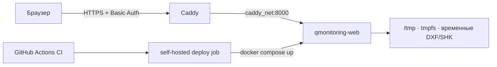

# Production-деплой web-MVP

Web-MVP запускается одним Docker Compose-сервисом и подключается к уже существующей
внешней сети Caddy. Порт приложения не публикуется на хосте: единственная публичная
точка входа — Caddy с HTTPS и Basic Auth.

## Архитектура



Контейнер запускается непривилегированным пользователем, с read-only root filesystem и
удаляет загруженные файлы вместе с временным каталогом после ответа. В `tmpfs` выделено
256 МБ; HTTP-слой дополнительно ограничивает каждый загружаемый файл 30 МБ.

## Что требуется на сервере

1. Linux self-hosted GitHub Runner с метками `self-hosted` и `linux`.
2. Docker Engine и Docker Compose v2.
3. Пользователь runner имеет доступ к Docker daemon.
4. Запущенный Caddy Compose уже создал сеть `caddy_net`.

Проверка сети:

```bash
docker network inspect caddy_net
```

Если Caddy ещё ни разу не запускался, сеть создаст его Compose-конфигурация с
`name: caddy_net`. Вручную создавать вторую сеть с другим именем не нужно.

## Автоматический деплой

Обычный workflow `CI` запускает Ruff, pytest, compileall, сборку wheel, проверку Compose
и сборку production-образа на GitHub-hosted runner. После успешного `push` в `main`
workflow `Deploy`:

1. получает точный SHA, который прошёл CI;
2. проверяет Docker и наличие `caddy_net`;
3. выполняет `docker compose up --detach --build --remove-orphans --wait`;
4. ждёт успешного `/healthz` из Docker healthcheck.

Pull request не запускает job на self-hosted runner. Одновременно выполняется не более
одного production-деплоя.

## Ручной запуск на сервере

Из checkout репозитория:

```bash
docker compose --project-name qmonitoring --file compose.prod.yml up \
  --detach --build --remove-orphans --wait --wait-timeout 120
```

Проверка состояния и логов:

```bash
docker compose --project-name qmonitoring --file compose.prod.yml ps
docker compose --project-name qmonitoring --file compose.prod.yml logs --tail=200 qmonitoring-web
```

## Caddy и временная авторизация

Сначала сгенерировать bcrypt-хеш пароля внутри уже запущенного контейнера Caddy:

```bash
docker compose exec caddy caddy hash-password
```

Затем добавить в `Caddyfile`, заменив домен, имя пользователя и хеш:

```caddyfile
rebar.example.com {
    encode zstd gzip

    basic_auth {
        qmonitoring $2a$14$REPLACE_WITH_GENERATED_HASH
    }

    reverse_proxy qmonitoring-web:8000 {
        health_uri /healthz
        health_interval 30s
        health_timeout 5s
    }
}
```

Оба контейнера находятся в `caddy_net`, поэтому `qmonitoring-web` разрешается через
встроенный DNS Docker. `localhost:8000` в Caddyfile использовать нельзя: внутри
контейнера Caddy это адрес самого Caddy.

Проверить конфигурацию и применить её без остановки контейнера:

```bash
docker compose exec caddy caddy validate --config /etc/caddy/Caddyfile
docker compose exec caddy caddy reload --config /etc/caddy/Caddyfile
```

Basic Auth используется только поверх автоматически выпущенного Caddy HTTPS-сертификата.
Открытый пароль в `Caddyfile` не сохраняется — Caddy принимает только хеш.
