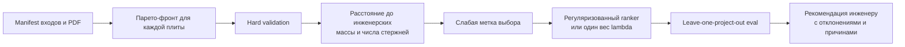

# Датасет инженерских решений для обучения предпочтений

Статус: manifest и числовой слой реализованы 28 августа 2026 года. Документ фиксирует,
что именно доступно для ML, а чего в данных пока нет.

## Результат инвентаризации

В локальных материалах есть:

- 11 независимых объединённых инженерских выдач;
- 15 четырёхнаправленных входных комплектов;
- 5 PDF с повторно извлечёнными plate-level спецификациями;
- 6 PDF со сломанным Unicode-слоем, которым нужен OCR или ручная транскрипция;
- 1 полный end-to-end golden-case (`plate-zero-k09`) с mapping, входами и сравнением
  результата алгоритма.

Пять доступных числовых наблюдений:

| ID | Позиций | Физических стержней | Масса, кг | Статус |
|---|---:|---:|---:|---|
| `k09-foundation` | 146 | 1357 | 21012,87 | PDF сверен; есть особые гнутые позиции |
| `k09-minus-2` | 51 | 856 | 3260,62 | PDF сверен |
| `plate-zero-k09` | 79 | 1019 | 3177,64 | PDF сверен, полный golden |
| `k09-above-1` | 78 | 880 | 1705,12 | PDF сверен |
| `k09-typical-3-14` | 74 | 1227 | 2878,76 | один результат для входов 3-го и 9-го этажей |

Числа получены только с релевантных листов дополнительного продольного армирования.
Листы фонового армирования, балок, поперечных каркасов и парапетов в суммы не входят.
Каждый выбранный лист проверен по заголовку на рендере PDF, а строки спецификации повторно
извлекаются при запуске отчёта.

## Что является обучающей меткой

Это не размеченные «Точки 3» и не геометрия прямоугольников. Каждый PDF показывает один
финальный инженерный выбор. Поэтому сейчас это только слабое наблюдение предпочтения:

```text
входная плита -> инженер выбрал решение с такой массой и таким числом стержней
```

Нельзя обучать модель напрямую выдавать зоны или стержни. Сначала алгоритм обязан построить
набор допустимых решений, прошедших общий hard-валидатор. Обучаемая часть может только
ранжировать этот набор или калибровать положение на Парето-фронте.

## Целевой обучающий пайплайн



Для кандидата `c` первая прозрачная функция близости может выглядеть так:

```text
distance(c) =
    w_mass * abs(mass(c) - mass_engineer) / mass_engineer
  + w_bars * abs(bars(c) - bars_engineer) / bars_engineer
```

Это не окончательная функция качества. Она нужна, чтобы найти на нашем безопасном фронте
кандидата, наиболее близкого к наблюдаемому масштабу решения. Геометрический член можно
добавить только после DWG-to-DXF и извлечения инженерских зон.

## Честная схема эксперимента

1. Для каждого совместимого входа построить фронт одним бюджетом и несколькими seed.
2. Отбросить любой кандидат с недоармированием или нарушением hard-гейтов.
3. Найти ближайший к инженеру кандидат по нормализованным массе и физическим стержням.
4. Обучить только малопараметрическую модель выбора: один глобальный `lambda`, линейный
   ranker или регуляризованную pairwise-модель.
5. Проверять leave-one-project-out: целая инженерская выдача остаётся вне обучения.
6. Сравнить модель с простыми правилами: минимум массы, knee по кривизне, фиксированный
   процент от минимума и ручной выбор.
7. Показывать top-3 кандидата, а не скрыто принимать решение вместо конструктора.

Основные метрики:

- доля случаев, где top-1/top-3 содержит ближайший к инженеру кандидат;
- regret к ближайшему доступному допустимому кандидату;
- абсолютное и относительное отклонение массы и физических стержней;
- доля решений в гейте массы `<= 15%`;
- ноль случаев недоармирования;
- устойчивость выбора между seed на отложенном проекте.

## Первый выполненный эксперимент

Для `plate-zero-k09`, `k09-minus-2` и входа 3-го этажа из `k09-typical-3-14` построены
фронты с одинаковым бюджетом GA: `population=8`, `generations=3`, `seed=7`, ось
`zone_count`, политика UCB1. Две новые таблицы восстановлены из собственных PNG и
проверены на четырёх DXF каждого входа.

| Плита | Инженер, кг | Минимум GA, кг | Δ массы | Δ физических стержней |
|---|---:|---:|---:|---:|
| Нулевая | 3177,64 | 3424,34 | +7,76% | +29,44% |
| Над −2 этажом | 3260,62 | 3304,95 | +1,36% | +46,26% |
| Над 3 этажом | 2878,76 | 3026,58 | +5,13% | +22,25% |

`src/rebar/learning/preference.py` обучает один вес
`α·minmax(mass) + (1−α)·minmax(physical_bar_count)`. Слабая целевая точка определяется
только для train/eval как минимум равновзвешенного относительного расстояния до массы и
стержней инженера. При LOPO получено: глобальный `α=0,75`, top-1 `2/3`, top-3 `3/3`,
гейт массы `≤15%` у top-1 `2/3`. Отложенная плита нуля дала `+20,16%`, поэтому top-1
пока нельзя применять автоматически.

Это первый честный proof-of-concept обучения предпочтения, но всего три слабые метки.
Следующие блокеры: подтвердить функцию слабой цели у конструктора, добавить mapping ещё
для обычных плит, несколько seed на каждый проект и геометрические метрики после
извлечения инженерских зон. Фундаментная плита содержит формы вне прямоугольного MVP.

## Реализация

```text
src/rebar/golden/dataset_models.py
    контракты выдачи, входного комплекта и проверенного PDF-листа
src/rebar/golden/dataset_catalog.py
    переносимый manifest 11 выдач / 15 входов
src/rebar/golden/dataset_inventory.py
    разрешение источников, повторное извлечение и строгая сверка чисел
src/rebar/reporting/engineer_dataset.py
    JSON и краткий Markdown-отчёт
scripts/inventory_engineer_dataset.py
    локальная команда инвентаризации
src/rebar/learning/preference.py
    scalar ranker, слабая цель и leave-one-project-out без утечки проекта
scripts/calibrate_engineer_preference.py
    сборка calibration.json и автономного HTML по готовым benchmark.json
```

Запуск:

```bash
python3 scripts/inventory_engineer_dataset.py
python3 scripts/calibrate_engineer_preference.py \
  artifacts/genetic_benchmark_plate_zero_equal_budget/benchmark.json \
  artifacts/genetic_benchmark_k09_minus_2_smoke/benchmark.json \
  artifacts/genetic_benchmark_k09_above_3_smoke/benchmark.json
```

Результат создаётся в `artifacts/engineer_dataset/`. В Git попадает только manifest,
код, тесты и этот документ; исходные PDF/DXF и сгенерированные артефакты не коммитятся.
## Отдельная слабая калибровка на фронтах зон — 18 сентября

Для `zone-merge` реализована ridge-калибровка **выбора из готового полного
фронта** по массе и числу физических стержней. Число зон и инженерная
«Точка 3» не размечены. Manifest задаёт реальные `case_id` и источники
инженерских чисел; LOPO удерживает все отчёты одной выдачи вместе. В первом
baseline участвуют три выдачи К09 (над −2, типовой 3/14 этаж и плита нуля),
а не три независимых здания. Фундаментная выдача с гнутыми позициями не
используется, а плита над 1 этажом не проходит строгий ingest из-за
неподписанного занятого ACI 11 верхнего X-направления. Средний regret слабой
цели 0,0957 при top-1 = top-3 = 1/3; сравнение с геометрическим коленом и
минимумом массы не доказывает обобщение. [Полный протокол](zone-partition-experiment-2026-09-18.md).
