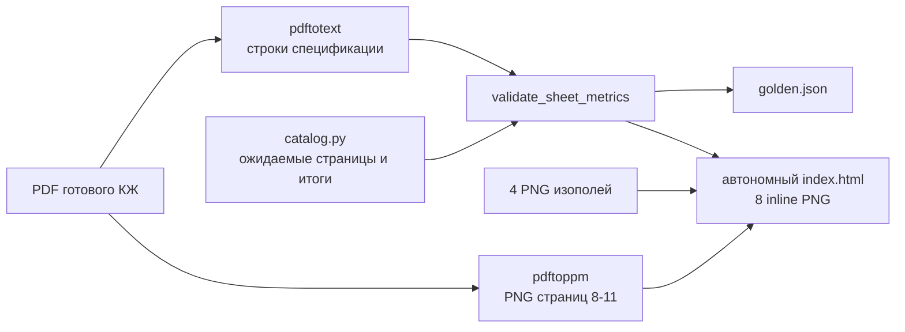

# Golden-case инженерной раскладки

Статус: первый проверенный эталон от 2026-08-19. Документ описывает пару
«входные изополя → ручная раскладка инженера» для корпуса 2.9, плиты нуля.

## Зачем он нужен

Baseline-алгоритмы можно сравнивать друг с другом, но это не отвечает на вопрос, похож
ли результат на нормальное инженерное решение. Golden-case даёт внешнюю контрольную
точку:

- четыре реальные входные мозаики `{низ/верх} × {X/Y}`;
- четыре соответствующих листа ручной раскладки;
- спецификации с длиной, диаметром, количеством и массой стержней;
- воспроизводимый тест, который перечитывает исходный PDF, а не доверяет вручную
  переписанной сумме;
- автономный HTML, где вход и решение инженера видны рядом.

Исходные материалы остаются в исключённом из Git каталоге `Дополнительные материалы/`.
В репозитории хранятся только manifest, парсер таблиц, тесты и инструкция.

## Источники и сопоставление

Вход находится в задании `2025.02.19_плита нуля`, готовый результат — в комплекте
`2025-05-20_ППТ8-1-Д2-Р-9-КЖ02.П1_плита нуля`.

| Направление ядра | Лист инженера | Страница PDF | Позиций | Стержней | Масса, кг |
|---|---|---:|---:|---:|---:|
| `bottom-X` | нижняя вдоль Б.О. | 9 | 17 | 213 | 700,60 |
| `bottom-Y` | нижняя вдоль Ц.О. | 8 | 16 | 192 | 651,58 |
| `top-X` | верхняя вдоль Б.О. | 11 | 24 | 322 | 999,02 |
| `top-Y` | верхняя вдоль Ц.О. | 10 | 22 | 292 | 826,44 |
| **Итого** | четыре направления | — | **79** | **1019** | **3177,64** |

Сопоставление `X → вдоль Б.О.`, `Y → вдоль Ц.О.` сделано по фактической ориентации
стержней и геометрии плиты. Его нужно подтвердить у конструктора до использования
покомпонентных отклонений как официальной метрики приёмки.

## Что нового видно в инженерной выдаче

На плане инженер показывает контуры прямоугольных участков дополнительного армирования,
а не семь отдельных линий стержней. Подпись участка содержит позицию, диаметр, шаг и
количество, например `П5 ⌀12, шаг 150 (7 шт.)`. Спецификация справа содержит:

- позицию/марку;
- диаметр и класс стали;
- полную длину одного стержня;
- число физических стержней;
- единичную и суммарную массу.

На листах явно приведены шаги 100, 150 и 300 мм. В примечании разрешено смещение
стержней в плане в пределах зоны усиления и запрещена их обрезка. Отдельные эскизы формы
стержней находятся в ведомости деталей, но не размещаются поштучно на плане. Поэтому
параметрический `LayoutZone` соответствует уровню результата инженера; разворачивание
его в реальные семейства остаётся задачей Revit-плагина.

Фундаментный комплект дополнительно содержит наклонные и гнутые специальные позиции
вокруг приямков. Они не укладываются в текущую модель одного осевого прямоугольника.
Для первого MVP эталоном выбрана обычная плита нуля; специальные краевые случаи должны
получить отдельную модель либо явный статус `unsupported`.

## Три разных счётчика

После изучения готового комплекта нельзя использовать слово «деталь» без уточнения:

```text
zone_count      = len(LayoutSolution.zones)
physical_bars   = sum(zone.bar_count for zone in LayoutSolution.zones)
position_count  = число уникальных строк спецификации после группировки по форме,
                  диаметру и длине
```

Текущий `LayoutMetrics.detail_count` исторически равен `zone_count`. Это внутренний
контракт baseline и он не переименовывается в рамках golden-case. Однако его нельзя
напрямую сравнивать ни с колонкой `Кол-во, шт.` инженерной спецификации, ни с осью
графика «Точка 1-4», пока заказчик не подтвердит семантику графика.

Для первого эталона надёжно сравниваются:

- `physical_bars`: 1019 шт.;
- масса дополнительной стали: 3177,64 кг;
- распределение этих двух метрик по четырём направлениям;
- 79 строк спецификаций как справочная метрика номенклатуры.

Количество прямоугольных инженерных групп и их IoU пока автоматически не извлекаются.

## Как устроена проверка



Код разделён по ответственности:

```text
src/rebar/golden/
  models.py       типы эталона и строк спецификации
  catalog.py      проверенные числа и сопоставление направлений
  sources.py      поиск локальных файлов с Unicode-нормализацией
  pdf_specs.py    pdftotext, pdftoppm и строгая сверка
src/rebar/reporting/golden.py
                  автономный HTML + golden.json
scripts/verify_golden_case.py
                  локальная команда демонстрации
tests/golden/
                  unit-тесты и интеграционный тест реального PDF
```

Если число позиций, стержней или масса хотя бы одного листа изменились, генерация HTML
завершается `GoldenReferenceMismatchError`. Это защищает от незаметной подмены PDF,
ошибочной страницы и регрессии парсера.

## Запуск

Нужен Poppler (`pdftotext` и `pdftoppm`). На macOS:

```bash
brew install poppler
```

Проверка чисел через pytest:

```bash
python3 -m pytest -q tests/golden
```

Сборка визуального отчёта:

```bash
python3 scripts/verify_golden_case.py
```

Результат:

```text
artifacts/golden_plate_zero/
  index.html    входные изополя и листы инженера; все картинки встроены base64
  golden.json   строки спецификаций и агрегаты
```

HTML не содержит абсолютных путей и внешних картинок. Его можно переслать как один файл;
по клику изображение открывается в увеличенном просмотре.

## Что пока не является golden-проверкой

- Растр листа используется для просмотра, но не для извлечения координат стержней.
- В PDF надёжно извлекается спецификация, но не прямоугольные группы и их границы.
- Эталонные DXF не содержат `.shk`, но для этой плиты зафиксирована явная таблица
  `plate-zero-d12-v1` из подписей PNG. Она позволяет построить `LayoutProblem`, однако
  остаётся MVP-допущением, а не универсально подтверждённым инженерным справочником.
- Сравнение массы не доказывает отсутствие недоармирования: алгоритмическое решение всё
  равно обязано пройти общий геометрический валидатор.
- Наклонные и гнутые специальные позиции фундаментной плиты находятся вне первого MVP.

## Следующее развитие eval-харнеса

1. Получить DXF-выгрузку листов 8-11 либо конвертировать DWG через ODA File Converter.
2. Извлечь инженерные группы, их bbox, шаг, диаметр и количество.
3. Сопоставить координаты с нормализованным `Mosaic` и проверить оси X/Y.
4. Добавить для каждого алгоритма отклонения массы, числа стержней, числа зон и IoU.
5. Использовать несколько плит как test/eval set, не настраивая коэффициенты на той же
   плите, которой измеряется итоговое качество.
