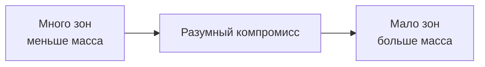
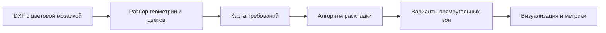

# Встреча с научным руководителем: постановка и итоги

Дата: **20 августа 2026 года**.

Источник: расшифровка записи `Запись_Встреча_с_Сергеем_Митягиным.mp3`, содержательная
часть `00:10:37–00:45:34`. Расшифровка получена 21 августа и использована для повторной
проверки прежней выжимки.

## Главное различие статусов

Научный консультант помогал с постановкой и методами оптимизации, но не выступал в роли
конструктора/технолога заказчика. Поэтому стенограмма содержит три разных типа выводов:

- **подтверждение контекста встречи** — например, общеплитный смысл графика;
- **архитектурная рекомендация** — например, вынести `40d` в постобработку;
- **исследовательская гипотеза** — например, пересечения, кластеризация или преимущество
  генетического поиска.

Гипотезы нельзя переносить в production-правила без проверки по ТЗ, готовым работам и,
где требуется, ответа конструктора/технолога.

## Проверенные по стенограмме выводы

| Время | Тема | Что фактически прозвучало | Статус для проекта |
|---|---|---|---|
| `12:55–16:17` | `40d` и шаг между зонами | Сергей предложил сначала оптимизировать логические прямоугольники, а удлинение и раздвижку выполнять формальными правилами после. Он объяснил, что включение всех условий прямо в поиск делает метод неустойчивым. | **Архитектурная рекомендация**, уже реализованная общей постобработкой. Итоговая масса считается после неё. |
| `13:36–15:15` | Пересечения | Сначала Сергей сказал, что не уверен, является ли наложение проблемой, затем предположил суммирование арматуры и по картинкам увидел возможную обрезку/наложение. Он прямо назвал это хорошим вопросом технологам. | **Рабочая гипотеза, не подтверждённое правило заказчика.** Research-профиль разрешает overlap, но слабые зоны не складываются до получения формулы `As`. |
| `16:17–16:45` | Одиночные выбросы | Было предложено удалять разрешённые ТЗ выбросы отдельной обработкой, а не усложнять ими оптимизатор. | **Рекомендация к preprocessing/repair.** Реализовывать только точное правило заказчика об одиночном КЭ и протоколировать изменения. |
| `17:38–19:56` | «Количество деталей» | Собеседники отделили физические стержни от числа фрагментов/зон. Этот параметр характеризует гранулярность; минимум и максимум можно получить из задачи, пользователь не обязан знать их заранее. | `LayoutZone`, физические стержни и позиции спецификации показываются отдельно. Ось графика всё ещё требует терминологического подтверждения заказчика. |
| `21:52–24:48`, `36:43–37:16` | Метод оптимизации | Сергей высказал подозрение, что простые deterministic/линейные методы будут давать слабый результат, и предложил экспериментировать между branch-and-bound и генетическими/эвристическими методами. | **Исследовательская рекомендация, не доказательство невозможности deterministic-методов.** Простые baseline остаются контролем; следующая новая ветка — GA, exact search нужен как oracle малых задач. |
| `23:01–25:43` | Где здесь ИИ | Эвристическую оптимизацию предложено позиционировать как rule-based/data-free AI. Обучаемый оператор мутации назван возможным развитием; ML/LLM также могут помогать с подписями и оформлением. | Для MVP ценность доказывается метриками, а не ярлыком «ИИ». Learned mutation и LLM-оформление — необязательные поздние эксперименты. |
| `29:22–31:39` | Кластеризация | Сергей предложил сначала выделять визуальные кластеры, но после уточнения значения цветов признал, что исходная идея может не подойти. | **Слабая гипотеза**, не новая обязательная стадия. Кластеры допустимы как seed/candidate reduction, но не как жёсткие границы зон. |
| `31:39–34:18` | Вторая метрика | Число зон трактовалось как приближение бизнес-цели: простоты раскладки рабочими. Предложено учитывать одинаковость стержней, число типов, логистику и, возможно, человеко-часы. | Для Парето-фронта одной массы и голого `zone_count` недостаточно. Нужен объяснимый proxy монтажной сложности. |
| `34:34–36:35` | Регрессия «Точки 3» | При небольшом вручную собранном наборе Сергей допустил простую регрессию; линейность была предположением из-за малого числа примеров. | **Гипотеза после появления меток**, не текущий способ выбрать точку. Сейчас размеченных колен нет. |
| `37:29–38:17` | Четыре направления | В разговоре был подтверждён суммарный смысл массы и количества по четырём направлениям графика. | Общеплитный агрегат обязателен; точная единица горизонтальной оси остаётся открытой. |
| `38:23–41:50` | `.shk`/mapping | Рекомендовано считать таблицу «цвет/уровень → стержень» настраиваемым входом; таблиц может быть несколько. Для эксперимента допустили применение одной имеющейся таблицы к другим плитам. | Только **явно выбранный MVP fallback**. Не применять молча и не объявлять универсальным: разные таблицы могут изменить не только масштаб, но и ранжирование решений. |
| `42:07–43:23` | Закруглённые детали | Сергей предложил отложить их, потому что в ТЗ они явно не описаны, хотя встречаются в реальных проектах. | **Согласованное ограничение MVP**, не утверждение об их неважности для production. |

## Что из стенограммы не следует

- пересечения и формула суммирования `As` не подтверждены конструктором заказчика;
- генетический алгоритм не гарантированно лучше и не освобождается от hard-валидации;
- небольшая выборка сама по себе не доказывает линейность выбора «Точки 3»;
- одна mapping-таблица не становится корректной для всех проектов;
- кластер одного цвета не становится обязательной границей выходного прямоугольника;
- понятие «деталь» не разрешено окончательно: известно лишь, что это не следует молча
  приравнивать к числу физических стержней.

## Уточнения после изучения работ инженеров

| Набор | Четырёхнаправленных входов | Независимых объединённых выдач |
|---|---:|---:|
| `Для верификации изополей` | 9 | 6 |
| `Для верификации изополей 2` | 6 | 5 |
| **Итого** | **15** | **11** |

Некоторые PDF объединяют две секции, а типовой комплект плит над 3–14 этажами объединяет
отдельные входы 3-го и 9-го этажей в одно решение. Поэтому входные наборы нельзя считать
независимыми регрессионными метками. Только плита нуля подключена к автоматическому
golden-тесту; ни один PDF не содержит явной Парето-кривой или пометки «Точка 3».

Практический вывод: сейчас есть максимум 11 слабых демонстраций финального выбора и 0
строго размеченных точек колена. Для первого эксперимента подходит регуляризованная
регрессия одного параметра либо inverse optimization с leave-one-project-out проверкой,
но не сложная ML-модель.

## О проекте за 30 секунд

Мы делаем программу, которая превращает расчётную цветовую карту железобетонной плиты
в понятную раскладку дополнительной арматуры.

На входе — множество небольших участков плиты. Для каждого участка известно, насколько
сильное армирование ему требуется. На выходе — набор прямоугольных зон с параметрами
арматуры: положением, диаметром, шагом, длиной и количеством стержней.

Оптимизация нужна потому, что два хороших свойства решения конфликтуют:

- много маленьких зон экономят сталь, но усложняют чертёж и монтаж;
- несколько крупных зон проще реализовать, но они дают перерасход стали.

Поэтому мы ищем не одно абстрактно «лучшее» решение, а несколько разумных вариантов
между минимальной массой и минимальным количеством зон.

## Постановка задачи

### Что приходит на вход

Расчётная система ЛИРА-САПР делит плиту на небольшие конечные элементы и вычисляет для
каждого требуемое дополнительное армирование. В DXF это представлено цветовой мозаикой:
каждому цвету соответствует определённый уровень армирования.

Условный пример:

```text
светлая область  → дополнительная арматура не нужна
зелёная область  → небольшой объём дополнительной арматуры
жёлтая область   → средний объём
красная область  → усиленное армирование
```

Для каждого уровня известна конфигурация стержней, например диаметр 20 мм и шаг 100 мм.

Одна плита рассчитывается отдельно для четырёх направлений:

```text
нижнее-X · нижнее-Y · верхнее-X · верхнее-Y
```

На момент встречи web обрабатывал один DXF. После встречи добавлен полный
комплект четырёх направлений и `PlateSolution`.

### Что должно получиться

Решение — набор прямоугольных зон дополнительного армирования. У каждой зоны есть:

- координаты и размеры;
- направление стержней;
- диаметр и шаг;
- количество и длина стержней;
- расчётная масса.

Эти данные в дальнейшем сможет использовать Revit-плагин. Само построение объектов в
Revit сейчас не является частью алгоритмического ядра.

### Почему нельзя просто обвести каждый цвет

Цвет показывает требование в конкретной точке, но не является границей готовой детали.
Одна прямоугольная зона может закрывать несколько соседних цветов. Она может захватить
и небольшой участок, где усиление не требовалось, если это делает раскладку значительно
проще.

Например:

| Вариант | Зон | Масса | Смысл |
|---|---:|---:|---|
| A | 20 | 5,0 т | экономно по стали, сложно в монтаже |
| B | 10 | 5,2 т | возможный компромисс |
| C | 3 | 6,8 т | просто в монтаже, большой перерасход |

Заранее выбрать лучший вариант нельзя: ценность упрощения монтажа должен определить
инженер или экономика проекта.

## Простая математическая формулировка

Для любого решения считаем два основных показателя:

```text
M — общая масса дополнительной арматуры
N — количество прямоугольных зон
```

Хотим одновременно уменьшать `M` и `N`:

```text
minimize (M, N)
```

Это была исходная упрощённая модель, обсуждавшаяся на встрече. По итогу само
`N` нужно трактовать как первый proxy монтажной сложности, а не как окончательную
бизнес-метрику. Следует добавить число типов стержней/длин/диаметров и позже сверить
их с трудозатратами.

При этом каждый участок плиты должен получить не меньше требуемого уровня армирования.
Более сильное армирование разрешено, но его дополнительная масса учитывается.

Практически задачу можно решать так:

```text
для разных ограничений K
    найти минимальную массу при количестве зон N ≤ K
```

Получится ряд вариантов — от подробной лёгкой раскладки до простой тяжёлой. Среди них
нас особенно интересует «колено»: точка, после которой небольшое уменьшение количества
зон начинает стоить слишком большого прироста массы.



## Как устроено текущее решение



1. Парсер читает геометрию конечных элементов и цветовую шкалу из DXF.
2. Цвета переводятся в конкретные требования к дополнительной арматуре.
3. Алгоритм формирует прямоугольные зоны.
4. Для каждой зоны рассчитываются стержни и масса.
5. В web-интерфейсе показываются исходная мозаика, раскладка и график вариантов.

## Основной алгоритм MVP

Рабочее название — **жадное пространственное укрупнение**
(`spatial-partition-greedy`).

### Идея простыми словами

Сначала строим подробное решение из большого числа локальных прямоугольников. Затем
постепенно склеиваем соседние прямоугольники. Каждая склейка уменьшает количество зон,
но может увеличить массу, потому что новый прямоугольник закрывает лишнюю площадь или
получает более сильное армирование.

Алгоритм на каждом шаге выбирает наиболее выгодную склейку: ту, которая упрощает
раскладку с наименьшим увеличением массы.


### Один шаг алгоритма

Пусть рядом расположены две зоны:

```text
левая зона:  слабое армирование, масса 100 кг
правая зона: сильное армирование, масса 140 кг
```

После объединения весь общий прямоугольник должен удовлетворять более сильному
требованию. Допустим, его масса станет 270 кг.

```text
цена объединения = 270 − (100 + 140) = 30 кг
```

То есть одну зону мы убрали ценой 30 кг дополнительной стали. Алгоритм сравнивает такие
цены для всех возможных соседей и выбирает минимальную.

### Полный процесс

1. Пространство плиты разбивается на небольшие прямоугольные участки.
2. Каждому участку назначается максимальное требование попавших в него элементов.
3. Участки с одинаковыми требованиями собираются в начальные прямоугольники.
4. Для соседних прямоугольников строятся допустимые варианты объединения.
5. Для каждого варианта считается прирост массы.
6. Выполняется самое выгодное объединение.
7. Получившееся решение сохраняется как отдельная точка на графике.
8. Шаги повторяются до достижения заданного числа зон.

Важно, что один запуск создаёт не только финальную раскладку, но и всю цепочку
промежуточных вариантов. Из неё уже можно выбирать компромисс между массой и
количеством зон.

## Что было гото к моменту встречи

- DXF-парсер реальных расчётных файлов;
- автоматическая нормализация метров и миллиметров;
- чтение цветовой шкалы и назначений арматуры;
- несколько взаимозаменяемых baseline-алгоритмов;
- основной алгоритм пространственного укрупнения;
- расчёт геометрии, количества стержней и массы;
- локальный web-интерфейс для загрузки одного DXF (теперь поддержаны четыре);
- визуализация исходной карты и полученных зон;
- график «масса — количество зон»;
- автоматические тесты парсера, алгоритмов и web-части.

## Результат на реальном примере

Для файла `С1_t_800_Верхняя по оси У.dxf` текущий алгоритм получил:

| Метрика | Значение |
|---|---:|
| Начальная подробная раскладка | 190 прямоугольников |
| Выбранная раскладка | 32 зоны |
| Сохранённые промежуточные варианты | 108 |
| Недоминируемые варианты внутри этой цепочки | 12 |
| Количество стержней | 993 |
| Расчётная масса | 6683,9 кг |

Главное достижение здесь — не само число 32, а появление большого набора отличающихся
решений. Теперь можно строить осмысленный график компромисса и выбирать вариант по
понятному критерию.

## Что можно показать на демонстрации

На демонстрации можно последовательно показать исходную цветовую мозаику, полученные
прямоугольные зоны, основные метрики и график промежуточных вариантов. Изменение
допустимого количества зон позволяет сразу увидеть, как меняются масса и сложность
раскладки.

## Вопросы, с которыми пришли на встречу

### 1. Корректна ли сама постановка?

Правильно ли рассматривать задачу как многокритериальное прямоугольное покрытие, где
минимизируются масса и количество зон? Как её точнее назвать в научной работе?

### 2. Как строить набор компромиссных решений?

Лучше последовательно ограничивать число зон и минимизировать массу или использовать
единую функцию вида `масса + коэффициент × количество зон`?

### 3. Как выбирать «колено» графика?

Можно ли формализовать момент, после которого дальнейшее сокращение зон становится
слишком дорогим, или этот выбор обязательно должен оставаться за инженером?

### 4. Как развивать текущий алгоритм?

Что исследовательски перспективнее:

- улучшать жадный алгоритм локальным поиском;
- использовать адаптивное разбиение пространства;
- применить CP-SAT/MILP как точный ориентир на небольших примерах;
- рассмотреть другой метод?

### 5. Как оценивать качество без полного эталона?

Достаточно ли массы и количества зон? Стоит ли дополнительно учитывать количество
стержней, площадь лишнего покрытия, устойчивость результата и нижнюю оценку оптимума?

### 6. Как поставить вычислительный эксперимент?

Какие синтетические примеры, baseline-методы и графики нужны, чтобы убедительно
сравнить алгоритмы и показать качество результата?

### 7. Нужна ли здесь модель предпочтений?

Если собрать готовые решения инженеров, можно ли затем обучать модель не строить
раскладку с нуля, а выбирать наиболее похожий на инженерный вариант из уже допустимых
решений?

## Готовый рассказ на 3 минуты

> Мы автоматизируем раскладку дополнительной арматуры железобетонной плиты. На входе
> получаем цветовую карту конечных элементов: для каждого небольшого участка известен
> требуемый уровень армирования. На выходе хотим получить прямоугольные зоны с
> параметрами стержней.
>
> Здесь конфликтуют два критерия. Много маленьких зон экономят сталь, но сложны для
> монтажа. Несколько крупных зон проще, но дают перерасход. Поэтому наша цель — получить
> набор компромиссных решений по массе и количеству зон.
>
> Сейчас основной алгоритм начинает с подробной раскладки и жадно объединяет соседние
> прямоугольники. Для каждого объединения он считает, сколько дополнительной массы мы
> заплатим за удаление одной зоны, выбирает самый выгодный шаг и сохраняет новое
> решение. На реальном файле получилась цепочка из 108 вариантов: от 190 начальных
> прямоугольников до выбранных 32 зон.
>
> На встрече мы хотим проверить математическую постановку, способ построения кривой
> компромисса и выбрать следующий исследовательский шаг: локальный поиск, адаптивное
> разбиение или точную модель на небольших задачах.

## Чек-лист итогов встречи

- [ ] уточнить научное название класса задачи;
- [x] считать общеплитные массу и сложность по четырём направлениям;
- [x] строить варианты с итоговой стоимостью после постобработки;
- [x] исследовать генетический алгоритм рядом с детерминированными baseline;
- [x] рассмотреть регрессию/inverse optimization только для выбора точки фронта;
- [ ] уточнить единицу «деталей», формулу суммирования `As` и метод оценки качества.

## Продуктовый follow-up команды · 21 августа

После обсуждения с ментором договорились не продолжать наращивание и ручной тюнинг
простых deterministic-baseline. Они остаются контрольной группой, а следующая новая ветка —
генетический поиск с фиксированным seed, repair и тем же hard-валидатором.

Демонстрация строится вокруг инженера, а не вокруг обещания «ИИ всё спроектировал»: система
предлагает несколько проверенных черновиков, показывает отклонения, а конструктор выбирает,
корректирует и подтверждает вариант. Продуктовые метрики и user story зафиксированы в
[`product-strategy.md`](product-strategy.md).

## Вопросы, оставшиеся после проверки записи

### Конструктору/технологу заказчика

1. Допустимы ли пересечения логических зон одного направления в выпускаемой раскладке?
2. Если да, суммируется ли `As` и по какой формуле; могут ли две слабые группы совместно
   обеспечить более сильное требование?
3. Что именно происходит с соседними группами после добавления `40d`: обрезка, сдвиг,
   сохранение overlap или изменение длины/фазы?
4. Как формально оценивать простоту монтажа: зоны, марки, число типов диаметров/длин,
   количество стержней или нормативные человеко-часы?
5. Когда допустимо использовать mapping другого проекта и как пользователь должен
   подтвердить такое допущение?

### Научному консультанту после первого GA-прототипа

1. Достаточно ли генома `split/merge/shift/change-level` или лучше кодировать дерево
   разбиения/набор прямоугольников?
2. Какой одинаковый бюджет сравнения выбрать: wall time, число fitness evaluation или
   оба ограничения?
3. Какой exact/branch-and-bound oracle разумно построить на малых масках для оценки
   optimality gap?
4. Как сравнивать многокритериальные методы: hypervolume, coverage Pareto-front,
   расстояние до engineer choice или комбинация метрик?
5. Какие данные нужны, прежде чем экспериментировать с learned mutation или регрессией
   выбора «Точки 3»?
